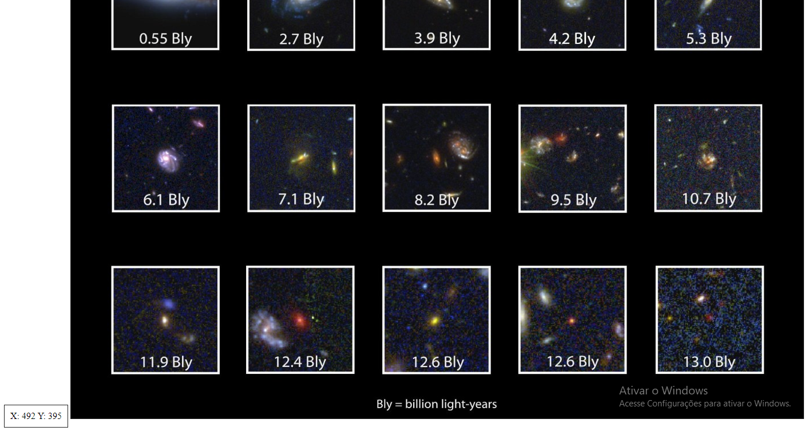

# Demo

## Coordenadas

|Links        |Telas        |
|---          |---          |
| [030.mouse-xy-position](https://renatomportugal.github.io/template/030.mouse-xy-position/) |  |
| [030.mouse-xy-position](https://renatomportugal.github.io/template/030.mouse-xy-position/) ||
| [030.mouse-xy-position](https://renatomportugal.github.io/template/030.mouse-xy-position/) ||
| [013.einstein-relativity-codepen-stellar-scientists](https://renatomportugal.github.io/template/013.einstein-relativity-codepen-stellar-scientists/) ||
| [042.web-animations-sound-and-custom-cursor-mix](https://renatomportugal.github.io/template/042.web-animations-sound-and-custom-cursor-mix/) ||
| [002.animation-project](https://renatomportugal.github.io/template/002.animation-project/) ||
| [006.CodePen_Export_mapsv](https://renatomportugal.github.io/template/006.CodePen_Export_mapsv/) ||
| [009.crop-image-with-focus-point-cropper](https://renatomportugal.github.io/template/009.crop-image-with-focus-point-cropper/) ||
| [017.image-cropper-2012-07-04](https://renatomportugal.github.io/template/017.image-cropper-2012-07-04/) ||
| [027.linear-interp](https://renatomportugal.github.io/template/027.linear-interp/) ||
| [029.mouse-coord](https://renatomportugal.github.io/template/029.mouse-coord/) ||

## IHM - Interface Homem Máquina

|Links                          |Telas        |
|---          					|---          |
| [020.self-destruct-button](https://renatomportugal.github.io/template/020.self-destruct-button/) |  |

## Infográfico

* [023.infografico-json](https://renatomportugal.github.io/template/023.infografico-json/)
* [035.pure-css-circles-infographic-JSON](https://renatomportugal.github.io/template/035.pure-css-circles-infographic-JSON/)
* [037.responsive-infographic-css-variables-grid.JSON](https://renatomportugal.github.io/template/037.responsive-infographic-css-variables-grid.JSON/)

## Lista de Pessoas

* [039.user-list-with-quick-search](https://renatomportugal.github.io/template/039.user-list-with-quick-search/)
* [001.alan-sugar-s-fired-employeesvue-transitions-challenge](https://renatomportugal.github.io/template/001.alan-sugar-s-fired-employeesvue-transitions-challenge/)
* [033.police-academy-characters](https://renatomportugal.github.io/template/033.police-academy-characters/)
* [038.tabs-navigation-ui](https://renatomportugal.github.io/template/038.tabs-navigation-ui/)
* [041.vuetify-avatars-group](https://renatomportugal.github.io/template/041.vuetify-avatars-group/)

## Responsivo

* [005.chrome-bug-blurry-stops-when-more-than-8-colors](https://renatomportugal.github.io/template/005.chrome-bug-blurry-stops-when-more-than-8-colors/)
* [031.padding-versus-margin-in-the-real-world](https://renatomportugal.github.io/template/031.padding-versus-margin-in-the-real-world/)

## Organograma

* [012.Cursos](https://renatomportugal.github.io/template/012.Cursos/)

## Preview de Upload

* [014.file-upload-preview-image](https://renatomportugal.github.io/template/014.file-upload-preview-image/)
* [019.image-upload-preview](https://renatomportugal.github.io/template/019.image-upload-preview/)
* [025.jquery-image-upload-preview](https://renatomportugal.github.io/template/025.jquery-image-upload-preview/)
* [026.knockout-js-html5-file-bindings-with-upload-preview-and-drag-and-drop](https://renatomportugal.github.io/template/026.knockout-js-html5-file-bindings-with-upload-preview-and-drag-and-drop/)

## Diagrama de Força

* [015.force-directed-diagram](https://renatomportugal.github.io/template/015.force-directed-diagram/)
* [024.it-system-interface-explorer](https://renatomportugal.github.io/template/024.it-system-interface-explorer/)

## Scroll Infinito

* [022.infinity-scroll-with-angularjs](https://renatomportugal.github.io/template/022.infinity-scroll-with-angularjs/)

## Mapeamento de Imagem

* [021.impact-summary-map-template-js-master](https://renatomportugal.github.io/template/021.impact-summary-map-template-js-master/)

## Crop

* [018.image-cropper-prototype](https://renatomportugal.github.io/template/018.image-cropper-prototype/)
* [040.vue_image-crop](https://renatomportugal.github.io/template/040.vue_image-crop/)
* [007.crop-image](https://renatomportugal.github.io/template/007.crop-image/)

## Upload ,Crop and save

* [034.practice-003crop-image](https://renatomportugal.github.io/template/034.practice-003crop-image/)

## Crop Com Máscara

* [008.crop-image-using-svg](https://renatomportugal.github.io/template/008.crop-image-using-svg/)

## Crop Base64

* [003.browser-image-crop](https://renatomportugal.github.io/template/003.browser-image-crop/)
* [010.cropper-try](https://renatomportugal.github.io/template/010.cropper-try/)
* [011.croppie-modal-error](https://renatomportugal.github.io/template/011.croppie-modal-error/)

## Camadas

* [032.photo-id](https://renatomportugal.github.io/template/032.photo-id/)
* [016.handling-user-uploaded-images-by-derya](https://renatomportugal.github.io/template/016.handling-user-uploaded-images-by-derya/)
* [043.xlayers-2013-08-02](https://renatomportugal.github.io/template/043.xlayers-2013-08-02/)
* [044.z-index-and-stacking-context](https://renatomportugal.github.io/template/044.z-index-and-stacking-context/)
* [045.z-index-sass-management](https://renatomportugal.github.io/template/045.z-index-sass-management/)

## Canvas

* [004.canvas-events-2011-08-22](https://renatomportugal.github.io/template/004.canvas-events-2011-08-22/)

## Editor

* [028.map-creator](https://renatomportugal.github.io/template/028.map-creator/)

## Click Select

* [036.responsive-image-map-demo](https://renatomportugal.github.io/template/036.responsive-image-map-demo/)
