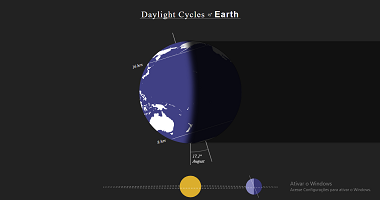

# Demo

## Astronomia

|Links        |Telas        |
|---          |---          |
| [062.daylight-cycles-of-earth](https://renatomportugal.github.io/template/062.daylight-cycles-of-earth) | |

## Botões

|Links        |Telas        |
|---          |---          |
| [063.draggable-skeuomorph-switchtoggle](https://renatomportugal.github.io/template/063.draggable-skeuomorph-switchtoggle) | |

## Busca

|Links        |Telas        |
|---          |---          |
| [059.searching-rod](https://renatomportugal.github.io/template/059.searching-rod) | |

## Cards

|Categoria        |Telas        |
|---              |---          |
| [066.product-sorter](https://renatomportugal.github.io/template/066.product-sorter/) |  |

## Código_Morse

|Links        |Telas        |
|---          |---          |
| [058.tgmtmorse](https://renatomportugal.github.io/template/058.tgmtmorse) | |
| [069.morse-code-alphabet](https://renatomportugal.github.io/template/069.morse-code-alphabet) | |

## Console

|Links        |Telas        |
|---          |---          |
| [068.responsive-retro-crt-screen-with-border-image-and-gradient](https://renatomportugal.github.io/template/068.responsive-retro-crt-screen-with-border-image-and-gradient) | |

## Coordenadas

|Links        |Telas        |
|---          |---          |
| [030.mouse-xy-position](https://renatomportugal.github.io/template/030.mouse-xy-position/) |  |
| [030.mouse-xy-position](https://renatomportugal.github.io/template/030.mouse-xy-position/) ||
| [030.mouse-xy-position](https://renatomportugal.github.io/template/030.mouse-xy-position/) ||
| [013.einstein-relativity-codepen-stellar-scientists](https://renatomportugal.github.io/template/013.einstein-relativity-codepen-stellar-scientists/) ||
| [042.web-animations-sound-and-custom-cursor-mix](https://renatomportugal.github.io/template/042.web-animations-sound-and-custom-cursor-mix/) ||
| [002.animation-project](https://renatomportugal.github.io/template/002.animation-project/) ||
| [006.CodePen_Export_mapsv](https://renatomportugal.github.io/template/006.CodePen_Export_mapsv/) ||
| [009.crop-image-with-focus-point-cropper](https://renatomportugal.github.io/template/009.crop-image-with-focus-point-cropper/) ||
| [017.image-cropper-2012-07-04](https://renatomportugal.github.io/template/017.image-cropper-2012-07-04/) ||
| [027.linear-interp](https://renatomportugal.github.io/template/027.linear-interp/) ||
| [029.mouse-coord](https://renatomportugal.github.io/template/029.mouse-coord/) ||

## CSS

|Links        |Telas        |
|---          |---          |
| [065.only-css-showcase-car](https://renatomportugal.github.io/template/065.only-css-showcase-car/) |  |

## Diagrama_De_Força

|Links        |Telas        |
|---          |---          |
| [015.force-directed-diagram](https://renatomportugal.github.io/template/015.force-directed-diagram/) ||
| [024.it-system-interface-explorer](https://renatomportugal.github.io/template/024.it-system-interface-explorer/) ||

## E-Commerce

|Links        |Telas        |
|---          |---          |
| [060.CodePen_Export_Nqwbmg](https://renatomportugal.github.io/template/060.CodePen_Export_Nqwbmg) | |

## Fonts

|Links        |Telas        |
|---          |---          |
| [064.old-paper](https://renatomportugal.github.io/template/064.old-paper) | |

## IHM - Interface Homem Máquina

|Links        |Telas        |
|---          |---          |
| [020.self-destruct-button](https://renatomportugal.github.io/template/020.self-destruct-button/) |  |

## Imagem_Camadas

|Links        |Telas        |
|---          |---          |
| [032.photo-id](https://renatomportugal.github.io/template/032.photo-id/) ||
| [016.handling-user-uploaded-images-by-derya](https://renatomportugal.github.io/template/016.handling-user-uploaded-images-by-derya/) ||
| [043.xlayers-2013-08-02](https://renatomportugal.github.io/template/043.xlayers-2013-08-02/) ||
| [044.z-index-and-stacking-context](https://renatomportugal.github.io/template/044.z-index-and-stacking-context/) ||
| [045.z-index-sass-management](https://renatomportugal.github.io/template/045.z-index-sass-management/) ||

## Imagem_Cortar_Subir_Salvar

|Links        |Telas        |
|---          |---          |
| [034.practice-003crop-image](https://renatomportugal.github.io/template/034.practice-003crop-image/) ||

## Imagem_Corte

|Links        |Telas        |
|---          |---          |
| [018.image-cropper-prototype](https://renatomportugal.github.io/template/018.image-cropper-prototype/) ||
| [040.vue_image-crop](https://renatomportugal.github.io/template/040.vue_image-crop/) ||
| [007.crop-image](https://renatomportugal.github.io/template/007.crop-image/) ||

## Imagem_Corte_Base64

|Links        |Telas        |
|---          |---          |
| [003.browser-image-crop](https://renatomportugal.github.io/template/003.browser-image-crop/) ||
| [010.cropper-try](https://renatomportugal.github.io/template/010.cropper-try/) ||
| [011.croppie-modal-error](https://renatomportugal.github.io/template/011.croppie-modal-error/) ||

## Imagem_Corte_Com_Mascara

|Links        |Telas        |
|---          |---          |
| [008.crop-image-using-svg](https://renatomportugal.github.io/template/008.crop-image-using-svg/) ||

## Imagem_Mapeamento

|Links        |Telas        |
|---          |---          |
| [021.impact-summary-map-template-js-master](https://renatomportugal.github.io/template/021.impact-summary-map-template-js-master/) ||

## Infográfico

|Links        |Telas        |
|---          |---          |
| [023.infografico-json](https://renatomportugal.github.io/template/023.infografico-json/) | |
| [035.pure-css-circles-infographic-JSON](https://renatomportugal.github.io/template/035.pure-css-circles-infographic-JSON/) | |
| [037.responsive-infographic-css-variables-grid.JSON](https://renatomportugal.github.io/template/037.responsive-infographic-css-variables-grid.JSON/) | |

## Layout

|Links        |Telas        |
|---          |---          |
| [067.pyramid-layout](https://renatomportugal.github.io/template/067.pyramid-layout) | |

## Landing_Page

|Links        |Telas        |
|---          |---          |
| [061.codepenchallenge-typeset-this-post](https://renatomportugal.github.io/template/061.codepenchallenge-typeset-this-post) | |

## Lista de Pessoas

|Links        |Telas        |
|---          |---          |
| [039.user-list-with-quick-search](https://renatomportugal.github.io/template/039.user-list-with-quick-search/) ||
| [001.alan-sugar-s-fired-employeesvue-transitions-challenge](https://renatomportugal.github.io/template/001.alan-sugar-s-fired-employeesvue-transitions-challenge/) ||
| [033.police-academy-characters](https://renatomportugal.github.io/template/033.police-academy-characters/) ||
| [038.tabs-navigation-ui](https://renatomportugal.github.io/template/038.tabs-navigation-ui/) ||
| [041.vuetify-avatars-group](https://renatomportugal.github.io/template/041.vuetify-avatars-group/) ||

## Organograma

|Links        |Telas        |
|---          |---          |
| [012.Cursos](https://renatomportugal.github.io/template/012.Cursos/) ||

## Preview de Upload

|Links        |Telas        |
|---          |---          |
| [014.file-upload-preview-image](https://renatomportugal.github.io/template/014.file-upload-preview-image/) ||
| [019.image-upload-preview](https://renatomportugal.github.io/template/019.image-upload-preview/) ||
| [025.jquery-image-upload-preview](https://renatomportugal.github.io/template/025.jquery-image-upload-preview/) ||
| [026.knockout-js-html5-file-bindings-with-upload-preview-and-drag-and-drop](https://renatomportugal.github.io/template/026.knockout-js-html5-file-bindings-with-upload-preview-and-drag-and-drop/) ||

## Responsivo

|Links        |Telas        |
|---          |---          |
| [005.chrome-bug-blurry-stops-when-more-than-8-colors](https://renatomportugal.github.io/template/005.chrome-bug-blurry-stops-when-more-than-8-colors/) ||
| [031.padding-versus-margin-in-the-real-world](https://renatomportugal.github.io/template/031.padding-versus-margin-in-the-real-world/) ||

## Scroll Infinito

|Links        |Telas        |
|---          |---          |
| [022.infinity-scroll-with-angularjs](https://renatomportugal.github.io/template/022.infinity-scroll-with-angularjs/) ||

## Canvas

|Links        |Telas        |
|---          |---          |
| [004.canvas-events-2011-08-22](https://renatomportugal.github.io/template/004.canvas-events-2011-08-22/) ||

## Editor

|Links        |Telas        |
|---          |---          |
| [028.map-creator](https://renatomportugal.github.io/template/028.map-creator/) ||

## Click Select

|Links        |Telas        |
|---          |---          |
| [036.responsive-image-map-demo](https://renatomportugal.github.io/template/036.responsive-image-map-demo/) ||

## 3D

|Links        |Telas        |
|---          |---          |
| [046.Blender.jpg](https://renatomportugal.github.io/template/046.Blender/) | |
| [047.layered-parallax-effect](https://renatomportugal.github.io/template/047.layered-parallax-effect/) | |
|ÓCULOS       |             |
| [048.3d-glasses-comedy-tragedy](https://renatomportugal.github.io/template/048.3d-glasses-comedy-tragedy/) | |
| [049.3d-glasses-radical-mathematical](https://renatomportugal.github.io/template/049.3d-glasses-radical-mathematical/) | |
| [050.animated-details-element-week-11-52](https://renatomportugal.github.io/template/050.animated-details-element-week-11-52/) | |
|ANIMAÇÃO     |             |
| [051.3d-city-animation-pure-css](https://renatomportugal.github.io/template/051.3d-city-animation-pure-css/) | |
| [052.3d-web](https://renatomportugal.github.io/template/052.3d-web/) | |
| [053.11-z-noise-threejs](https://renatomportugal.github.io/template/053.11-z-noise-threejs/) | |
| [054.fake-3d-effect-with-depth-map](https://renatomportugal.github.io/template/054.fake-3d-effect-with-depth-map/) | |
| [055.three-js-earth](https://renatomportugal.github.io/template/055.three-js-earth/) | |
| [056.WebGLRobot](https://renatomportugal.github.io/template/056.WebGLRobot/) | |
| [057.dog-selector](https://renatomportugal.github.io/template/057.dog-selector/) | |

## Novo

|Links        |Telas        |
|---          |---          |
| [046.Blender](https://renatomportugal.github.io/template/) | |