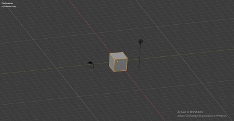
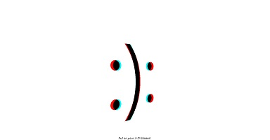
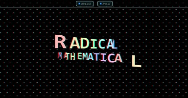
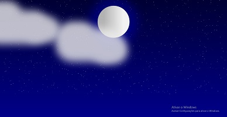
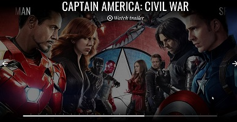
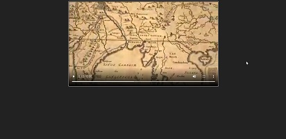

# Demo

## 360°

|Links        |Telas        |
|---          |---          |
| [093.threesixtyjs-master](https://renatomportugal.github.io/template/093.threesixtyjs-master/) | |

## 3D

|Links        |Telas        |
|---          |---          |
| [046.Blender](https://renatomportugal.github.io/template/046.Blender/) | |
| [047.layered-parallax-effect](https://renatomportugal.github.io/template/047.layered-parallax-effect/) | |
|ÓCULOS       |             |
| [048.3d-glasses-comedy-tragedy](https://renatomportugal.github.io/template/048.3d-glasses-comedy-tragedy/) | |
| [049.3d-glasses-radical-mathematical](https://renatomportugal.github.io/template/049.3d-glasses-radical-mathematical/) | |
| [050.animated-details-element-week-11-52](https://renatomportugal.github.io/template/050.animated-details-element-week-11-52/) | |
|ANIMAÇÃO     |             |
| [051.3d-city-animation-pure-css](https://renatomportugal.github.io/template/051.3d-city-animation-pure-css/) | |
| [052.3d-web](https://renatomportugal.github.io/template/052.3d-web/) | |
| [053.11-z-noise-threejs](https://renatomportugal.github.io/template/053.11-z-noise-threejs/) | |
| [054.fake-3d-effect-with-depth-map](https://renatomportugal.github.io/template/054.fake-3d-effect-with-depth-map/) | |
| [055.three-js-earth](https://renatomportugal.github.io/template/055.three-js-earth/) | |
| [056.WebGLRobot](https://renatomportugal.github.io/template/056.WebGLRobot/) | |
| [057.dog-selector](https://renatomportugal.github.io/template/057.dog-selector/) | |

## 8_bits

|Links        |Telas        |
|---          |---          |
| [092.hello-worldcontenteditable-arcade-game-text-effect](https://renatomportugal.github.io/template/092.hello-worldcontenteditable-arcade-game-text-effect/) | |

## Alfabeto

|Links        |Telas        |
|---          |---          |
| [094.alphabet](https://renatomportugal.github.io/template/094.alphabet/) | |

## AnaliseDePalavra

|Links        |Telas        |
|---          |---          |
| [095.word-graphic](https://renatomportugal.github.io/template/095.word-graphic/) | |

## Aparelhos

|Calculadora  |Telas        |
|---          |---          |
| [096.Calculadora](https://renatomportugal.github.io/template/096.Calculadora/) | |

## Astronomia

|Links        |Telas        |
|---          |---          |
| [062.daylight-cycles-of-earth](https://renatomportugal.github.io/template/062.daylight-cycles-of-earth) | |

## Audio

|Click        |Telas        |
|---          |---          |
| [098.air-horns](https://renatomportugal.github.io/template/098.air-horns) | |
| [120.sound-links-menu](https://renatomportugal.github.io/template/120.sound-links-menu) | |

## Background
|Click        |Telas        |
| [116.carnaval](https://renatomportugal.github.io/template/116.carnaval) | |
|Click        |Telas        |
| [103.Lua](https://renatomportugal.github.io/template/103.Lua) | |
|Outros       |Telas        |
| [104.crossing-walls](https://renatomportugal.github.io/template/104.crossing-walls) | |
| [105.perticle-rotation-05](https://renatomportugal.github.io/template/105.perticle-rotation-05) | |
| [106.tunnel-ride-ii](https://renatomportugal.github.io/template/106.tunnel-ride-ii) | |

## Bordados

|Click        |Telas        |
|---          |---          |
| [108.single-div-css-cross-stitch](https://renatomportugal.github.io/template/108.single-div-css-cross-stitch) | |

## Bordas

|Click        |Telas        |
|---          |---          |
| [109.dashed-border-generator](https://renatomportugal.github.io/template/109.dashed-border-generator) | |

## Busca

|Links        |Telas        |
|---          |---          |
| [059.searching-rod](https://renatomportugal.github.io/template/059.searching-rod) | |

## Canvas

|Links        |Telas        |
|---          |---          |
| [004.canvas-events-2011-08-22](https://renatomportugal.github.io/template/004.canvas-events-2011-08-22/) ||

## Cards

|Categoria        |Telas        |
| [066.product-sorter](https://renatomportugal.github.io/template/066.product-sorter/) |  |
|Hover            |Telas        |
| [113.services_tabs](https://renatomportugal.github.io/template/113.services_tabs/) |  |
|Outros           |Telas        |
| [114.card_styles](https://renatomportugal.github.io/template/114.card_styles/) |  |
| [115.information_cards](https://renatomportugal.github.io/template/115.information_cards/) |  |

## Cards

|Não Resposivos   |Telas        |
| [117.chatroom-project](https://renatomportugal.github.io/template/117.chatroom-project/) |  |
| [118.chat-widget](https://renatomportugal.github.io/template/118.chat-widget/) |  |
|Resposivos       |Telas        |
| [119.elegant_bootstrap_4_message_chat_box_template](https://renatomportugal.github.io/template/119.elegant_bootstrap_4_message_chat_box_template/) |  |

## Click Select

|Links        |Telas        |
|---          |---          |
| [036.responsive-image-map-demo](https://renatomportugal.github.io/template/036.responsive-image-map-demo/) ||

## Código_Morse

|Links        |Telas        |
|---          |---          |
| [058.tgmtmorse](https://renatomportugal.github.io/template/058.tgmtmorse) | |
| [069.morse-code-alphabet](https://renatomportugal.github.io/template/069.morse-code-alphabet) | |

## Color

|Picker       |Telas        |
| [133.isometric-color-picker](https://renatomportugal.github.io/template/133.isometric-color-picker/) |  |

## Console

|Links        |Telas        |
|---          |---          |
| [068.responsive-retro-crt-screen-with-border-image-and-gradient](https://renatomportugal.github.io/template/068.responsive-retro-crt-screen-with-border-image-and-gradient) | |

## Controles

|Botões       |Telas        |
| [127.buttonFuturistic](https://renatomportugal.github.io/template/127.buttonFuturistic) | |
| [129.jqueryswitch-2014-01-28](https://renatomportugal.github.io/template/129.jqueryswitch-2014-01-28) | |
| [130.social-app-menu](https://renatomportugal.github.io/template/130.social-app-menu) | |
|DropDown     |Telas        |
| [128.single-selectiondevextreme-jquery-drop-down-box](https://renatomportugal.github.io/template/128.single-selectiondevextreme-jquery-drop-down-box) | |

## Conversões

|Base64       |Telas        |
|---          |---          |
| [107.visualization-of-base64-encoding](https://renatomportugal.github.io/template/107.visualization-of-base64-encoding) | |

## Coordenadas

|Links        |Telas        |
|---          |---          |
| [030.mouse-xy-position](https://renatomportugal.github.io/template/030.mouse-xy-position/) |  |
| [030.mouse-xy-position](https://renatomportugal.github.io/template/030.mouse-xy-position/) ||
| [030.mouse-xy-position](https://renatomportugal.github.io/template/030.mouse-xy-position/) ||
| [013.einstein-relativity-codepen-stellar-scientists](https://renatomportugal.github.io/template/013.einstein-relativity-codepen-stellar-scientists/) ||
| [042.web-animations-sound-and-custom-cursor-mix](https://renatomportugal.github.io/template/042.web-animations-sound-and-custom-cursor-mix/) ||
| [002.animation-project](https://renatomportugal.github.io/template/002.animation-project/) ||
| [006.CodePen_Export_mapsv](https://renatomportugal.github.io/template/006.CodePen_Export_mapsv/) ||
| [009.crop-image-with-focus-point-cropper](https://renatomportugal.github.io/template/009.crop-image-with-focus-point-cropper/) ||
| [017.image-cropper-2012-07-04](https://renatomportugal.github.io/template/017.image-cropper-2012-07-04/) ||
| [027.linear-interp](https://renatomportugal.github.io/template/027.linear-interp/) ||
| [029.mouse-coord](https://renatomportugal.github.io/template/029.mouse-coord/) ||

## CSS

|Links        |Telas        |
|---          |---          |
| [065.only-css-showcase-car](https://renatomportugal.github.io/template/065.only-css-showcase-car/) |  |

## Data-Table

|Links          |Telas        |
|Não Responsivo |---          |
| [135.panel_tables_with_filter](https://renatomportugal.github.io/template/135.panel_tables_with_filter/) |  |
| [138.dashboard-with-webdatarocks-and-fusioncharts-dark-theme](https://renatomportugal.github.io/template/138.dashboard-with-webdatarocks-and-fusioncharts-dark-theme/) |  |
| [141.material-sortable-datatable](https://renatomportugal.github.io/template/141.material-sortable-datatable/) |  |
| [143.responsive-table-with-datatables](https://renatomportugal.github.io/template/143.responsive-table-with-datatables/) |  |
|Responsivo     |---          |
| [136.billionaires-responsive-table034-of-100days100projects](https://renatomportugal.github.io/template/136.billionaires-responsive-table034-of-100days100projects/) |  |
| [137.codepen_aLVXGO](https://renatomportugal.github.io/template/137.codepen_aLVXGO/) |  |
| [140.mantenimiento-simple-con-angular-material-y-lodash](https://renatomportugal.github.io/template/140.mantenimiento-simple-con-angular-material-y-lodash/) |  |
| [142.responsive-product-comparison-table](https://renatomportugal.github.io/template/142.responsive-product-comparison-table/) |  |
| [144.table2](https://renatomportugal.github.io/template/144.table2/) |  |

## Diagrama_De_Força

|Links        |Telas        |
|---          |---          |
| [015.force-directed-diagram](https://renatomportugal.github.io/template/015.force-directed-diagram/) ||
| [024.it-system-interface-explorer](https://renatomportugal.github.io/template/024.it-system-interface-explorer/) ||

## E-Commerce

|Links        |Telas        |
|---          |---          |
| [060.CodePen_Export_Nqwbmg](https://renatomportugal.github.io/template/060.CodePen_Export_Nqwbmg) | |

## Editor

|Links        |Telas        |
|---          |---          |
| [028.map-creator](https://renatomportugal.github.io/template/028.map-creator/) ||

## Fonts

|Links        |Telas        |
|---          |---          |
| [064.old-paper](https://renatomportugal.github.io/template/064.old-paper) | |

## Forms

|Links        |Telas        |
| [131.bootstrap-3-contact-form-with-validation](https://renatomportugal.github.io/template/131.bootstrap-3-contact-form-with-validation/) |  |
| [132.elegant-contact-form](https://renatomportugal.github.io/template/132.elegant-contact-form/) |  |

## Hover

|Botões       |Telas        |
| [110.fireflies](https://renatomportugal.github.io/template/110.fireflies/) |  |

## IHM - Interface Homem Máquina

|Botões       |Telas        |
| [020.self-destruct-button](https://renatomportugal.github.io/template/020.self-destruct-button/) |  |
| [063.draggable-skeuomorph-switchtoggle](https://renatomportugal.github.io/template/063.draggable-skeuomorph-switchtoggle) | |
| [100.realistic-red-switch-pure-css](https://renatomportugal.github.io/template/100.realistic-red-switch-pure-css) | |
|Gauges       |Telas        |
| [121.barraHorizontal](https://renatomportugal.github.io/template/121.barraHorizontal/) |  |
| [122.circular1](https://renatomportugal.github.io/template/122.circular1/) |  |
| [123.circular2](https://renatomportugal.github.io/template/123.circular2/) |  |
| [124.circular3](https://renatomportugal.github.io/template/124.circular3/) |  |
| [125.Gauge](https://renatomportugal.github.io/template/125.Gauge/) |  |
| [126.ponteiro](https://renatomportugal.github.io/template/126.ponteiro/) |  |
|Painéis      |Telas        |
| [102.apollo-agc-apollo-guidance-computer](https://renatomportugal.github.io/template/102.apollo-agc-apollo-guidance-computer/) |  |
|Mostrador Mecânico |Telas        |
| [101.mechincal-number-counter](https://renatomportugal.github.io/template/101.mechincal-number-counter/) |  |

## Imagem_Camadas

|Links        |Telas        |
|---          |---          |
| [032.photo-id](https://renatomportugal.github.io/template/032.photo-id/) ||
| [016.handling-user-uploaded-images-by-derya](https://renatomportugal.github.io/template/016.handling-user-uploaded-images-by-derya/) ||
| [043.xlayers-2013-08-02](https://renatomportugal.github.io/template/043.xlayers-2013-08-02/) ||
| [044.z-index-and-stacking-context](https://renatomportugal.github.io/template/044.z-index-and-stacking-context/) ||
| [045.z-index-sass-management](https://renatomportugal.github.io/template/045.z-index-sass-management/) ||

## Imagem_Cortar_Subir_Salvar

|Links        |Telas        |
|---          |---          |
| [034.practice-003crop-image](https://renatomportugal.github.io/template/034.practice-003crop-image/) ||

## Imagem_Corte

|Links        |Telas        |
|---          |---          |
| [018.image-cropper-prototype](https://renatomportugal.github.io/template/018.image-cropper-prototype/) ||
| [040.vue_image-crop](https://renatomportugal.github.io/template/040.vue_image-crop/) ||
| [007.crop-image](https://renatomportugal.github.io/template/007.crop-image/) ||

## Imagem_Corte_Base64

|Links        |Telas        |
|---          |---          |
| [003.browser-image-crop](https://renatomportugal.github.io/template/003.browser-image-crop/) ||
| [010.cropper-try](https://renatomportugal.github.io/template/010.cropper-try/) ||
| [011.croppie-modal-error](https://renatomportugal.github.io/template/011.croppie-modal-error/) ||

## Imagem_Corte_Com_Mascara

|Links        |Telas        |
|---          |---          |
| [008.crop-image-using-svg](https://renatomportugal.github.io/template/008.crop-image-using-svg/) ||

## Imagem_Mapeamento

|Links        |Telas        |
|---          |---          |
| [021.impact-summary-map-template-js-master](https://renatomportugal.github.io/template/021.impact-summary-map-template-js-master/) ||

## Infográfico

|Links        |Telas        |
|---          |---          |
| [023.infografico-json](https://renatomportugal.github.io/template/023.infografico-json/) | |
| [035.pure-css-circles-infographic-JSON](https://renatomportugal.github.io/template/035.pure-css-circles-infographic-JSON/) | |
| [037.responsive-infographic-css-variables-grid.JSON](https://renatomportugal.github.io/template/037.responsive-infographic-css-variables-grid.JSON/) | |

## KeyGen

|Links        |Telas        |
|---          |---          |
| [097.KeyGen](https://renatomportugal.github.io/template/097.KeyGen) | |

## Layout

|Links        |Telas        |
|---          |---          |
| [067.pyramid-layout](https://renatomportugal.github.io/template/067.pyramid-layout) | |

## Landing_Page

|Links        |Telas        |
|---          |---          |
| [061.codepenchallenge-typeset-this-post](https://renatomportugal.github.io/template/061.codepenchallenge-typeset-this-post) | |

## Lista de Pessoas

|Links        |Telas        |
|---          |---          |
| [039.user-list-with-quick-search](https://renatomportugal.github.io/template/039.user-list-with-quick-search/) ||
| [001.alan-sugar-s-fired-employeesvue-transitions-challenge](https://renatomportugal.github.io/template/001.alan-sugar-s-fired-employeesvue-transitions-challenge/) ||
| [033.police-academy-characters](https://renatomportugal.github.io/template/033.police-academy-characters/) ||
| [038.tabs-navigation-ui](https://renatomportugal.github.io/template/038.tabs-navigation-ui/) ||
| [041.vuetify-avatars-group](https://renatomportugal.github.io/template/041.vuetify-avatars-group/) ||

## Organograma

|Links        |Telas        |
|---          |---          |
| [012.Cursos](https://renatomportugal.github.io/template/012.Cursos/) ||

## Paint_Brush
|Links        |Telas        |
| [112.native-js-day-8-drawing-canvas](https://renatomportugal.github.io/template/112.native-js-day-8-drawing-canvas) | |
## Preview de Upload

|Links        |Telas        |
|---          |---          |
| [014.file-upload-preview-image](https://renatomportugal.github.io/template/014.file-upload-preview-image/) ||
| [019.image-upload-preview](https://renatomportugal.github.io/template/019.image-upload-preview/) ||
| [025.jquery-image-upload-preview](https://renatomportugal.github.io/template/025.jquery-image-upload-preview/) ||
| [026.knockout-js-html5-file-bindings-with-upload-preview-and-drag-and-drop](https://renatomportugal.github.io/template/026.knockout-js-html5-file-bindings-with-upload-preview-and-drag-and-drop/) ||

## Responsivo

|Links        |Telas        |
|---          |---          |
| [005.chrome-bug-blurry-stops-when-more-than-8-colors](https://renatomportugal.github.io/template/005.chrome-bug-blurry-stops-when-more-than-8-colors/) ||
| [031.padding-versus-margin-in-the-real-world](https://renatomportugal.github.io/template/031.padding-versus-margin-in-the-real-world/) ||

## Scroll Infinito

|Links        |Telas        |
|---          |---          |
| [022.infinity-scroll-with-angularjs](https://renatomportugal.github.io/template/022.infinity-scroll-with-angularjs/) ||

## Texto

|Autocomplete |Telas        |
| [099.autocomplete](https://renatomportugal.github.io/template/099.autocomplete) | |

## Videos

|YouTube      |Telas        |
| [070.ng-youtube-embed-demo](https://renatomportugal.github.io/template/070.ng-youtube-embed-demo) | |
| [071.youtube-embeds-optimized-jquery-edition](https://renatomportugal.github.io/template/071.youtube-embeds-optimized-jquery-edition) | |
| [072.youtube-picture-in-picture-demo-for-desktop](https://renatomportugal.github.io/template/072.youtube-picture-in-picture-demo-for-desktop) | |
| [073.youtube-video](https://renatomportugal.github.io/template/073.youtube-video) | |
|Background   |Telas        |
| [074.background-video](https://renatomportugal.github.io/template/074.background-video) | |
| [075.background-video-random-playlist](https://renatomportugal.github.io/template/075.background-video-random-playlist) | |
| [076.blurred-video-effect-w-css-filter](https://renatomportugal.github.io/template/076.blurred-video-effect-w-css-filter) | |
| [077.fullscreen-background-video-with-mix-blend-mode-overlay-text](https://renatomportugal.github.io/template/077.fullscreen-background-video-with-mix-blend-mode-overlay-text) | |
| [078.fullscreen-html5-page-background-video](https://renatomportugal.github.io/template/078.fullscreen-html5-page-background-video) | |
| [079.maintenance-status-page-with-video-background](https://renatomportugal.github.io/template/079.maintenance-status-page-with-video-background) | |
| [080.video-button-animation](https://renatomportugal.github.io/template/080.video-button-animation) | |
| [134.rick-roll-knockout-text](https://renatomportugal.github.io/template/134.rick-roll-knockout-text) | |
|Catálogo     |Telas        |
| [081.movieCard](https://renatomportugal.github.io/template/081.movieCard) | |
|Filtros      |Telas        |
| [082.gradient-map-filters-on-video](https://renatomportugal.github.io/template/082.gradient-map-filters-on-video) | |
|Local        |Telas        |
| [083.video_local](https://renatomportugal.github.io/template/083.video_local) | |
| [084.videoHtml5](https://renatomportugal.github.io/template/084.videoHtml5) | |
|Scroll       |Telas        |
| [085.popout-video](https://renatomportugal.github.io/template/085.popout-video) | |
|Timeline     |Telas        |
| [086.mcu-timeline-carousel](https://renatomportugal.github.io/template/086.mcu-timeline-carousel) | |
|Outros       |Telas        |
| [087.basic-picture-in-picture-video](https://renatomportugal.github.io/template/087.basic-picture-in-picture-video) | |
| [088.easy-html5-video-custom-controls](https://renatomportugal.github.io/template/088.easy-html5-video-custom-controls) | |
| [089.html5-video-webvtt-example-master](https://renatomportugal.github.io/template/089.html5-video-webvtt-example-master) | |
| [090.picture-in-picture-video-player-new-on-chrome-70](https://renatomportugal.github.io/template/090.picture-in-picture-video-player-new-on-chrome-70) | |
| [091.picture-in-picture-web-api](https://renatomportugal.github.io/template/091.picture-in-picture-web-api) | |

## Novo

|Links        |Telas        |
|---          |---          |
| [046.Blender](https://renatomportugal.github.io/template/) | |