# Demo

## 360°

|Links        |Telas        |
|---          |---          |
| [093.threesixtyjs-master](https://renatomportugal.github.io/04.template/093.threesixtyjs-master/) | |
|Sõ Desktop   |Telas        |
| [321.3d-carousel-v4panorama](https://renatomportugal.github.io/04.template/321.3d-carousel-v4panorama/) | |

## 3D

|Links        |Telas        |
|---          |---          |
| [046.Blender](https://renatomportugal.github.io/04.template/046.Blender/) | |
| [047.layered-parallax-effect](https://renatomportugal.github.io/04.template/047.layered-parallax-effect/) | |
|ÓCULOS       |             |
| [048.3d-glasses-comedy-tragedy](https://renatomportugal.github.io/04.template/048.3d-glasses-comedy-tragedy/) | |
| [049.3d-glasses-radical-mathematical](https://renatomportugal.github.io/04.template/049.3d-glasses-radical-mathematical/) | |
| [050.animated-details-element-week-11-52](https://renatomportugal.github.io/04.template/050.animated-details-element-week-11-52/) | |
|ANIMAÇÃO     |             |
| [051.3d-city-animation-pure-css](https://renatomportugal.github.io/04.template/051.3d-city-animation-pure-css/) | |
| [052.3d-web](https://renatomportugal.github.io/04.template/052.3d-web/) | |
| [053.11-z-noise-threejs](https://renatomportugal.github.io/04.template/053.11-z-noise-threejs/) | |
| [054.fake-3d-effect-with-depth-map](https://renatomportugal.github.io/04.template/054.fake-3d-effect-with-depth-map/) | |
| [055.three-js-earth](https://renatomportugal.github.io/04.template/055.three-js-earth/) | |
| [056.WebGLRobot](https://renatomportugal.github.io/04.template/056.WebGLRobot/) | |
| [057.dog-selector](https://renatomportugal.github.io/04.template/057.dog-selector/) | |

## 404

|Links        |Telas        |
|---          |---          |
| [177.space-404](https://renatomportugal.github.io/04.template/177.space-404/) | |
| [178.stranger-things-intro](https://renatomportugal.github.io/04.template/178.stranger-things-intro/) | |

## 8_bits

|Links        |Telas        |
|---          |---          |
| [092.hello-worldcontenteditable-arcade-game-text-effect](https://renatomportugal.github.io/04.template/092.hello-worldcontenteditable-arcade-game-text-effect/) | |

## Abertura

|Links        |Telas        |
|---          |---          |
| [175.holy-robin-quotes](https://renatomportugal.github.io/04.template/175.holy-robin-quotes/) | |

## Admin

|Links        |Telas        |
|---          |---          |
| [182.simple-permission-interface](https://renatomportugal.github.io/04.template/182.simple-permission-interface/) | |

## AdobeXD

|Links        |Telas        |
|---          |---          |
| [183.adobe-xd-repeat-grid](https://renatomportugal.github.io/04.template/183.adobe-xd-repeat-grid/) | |

## Agenda

|Links        |Telas        |
|---          |---          |
| [184.agenda](https://renatomportugal.github.io/04.template/184.agenda/) | |
| [185.calendar-subway-agenda-view](https://renatomportugal.github.io/04.template/185.calendar-subway-agenda-view/) | |
| [186.codepen_omGPqo](https://renatomportugal.github.io/04.template/186.codepen_omGPqo/) | |
| [187.conference-schedule-with-css-grid](https://renatomportugal.github.io/04.template/187.conference-schedule-with-css-grid/) | |
| [188.display-schedule](https://renatomportugal.github.io/04.template/188.display-schedule/) | |
| [189.event-card-grid](https://renatomportugal.github.io/04.template/189.event-card-grid/) | |
| [190.event-card-slider](https://renatomportugal.github.io/04.template/190.event-card-slider/) | |
| [191.event-cards-responsive-arranging-blue-yellow](https://renatomportugal.github.io/04.template/191.event-cards-responsive-arranging-blue-yellow/) | |
| [192.flexbox-card-view-agenda](https://renatomportugal.github.io/04.template/192.flexbox-card-view-agenda/) | |
| [193.semantic-ui](https://renatomportugal.github.io/04.template/193.semantic-ui/) | |
| [194.vertical-timeline-agenda](https://renatomportugal.github.io/04.template/194.vertical-timeline-agenda/) | |
| [263.loop-2step-6](https://renatomportugal.github.io/04.template/263.loop-2step-6/) | |
|Ícones       |Telas        |
| [211.google-calendar-animated-icon](https://renatomportugal.github.io/04.template/211.google-calendar-animated-icon/) | |

## Album

|Links        |Telas        |
|---          |---          |
| [195.challenges-cat-album-with-vue](https://renatomportugal.github.io/04.template/195.challenges-cat-album-with-vue/) | |
| [196.css-grid-image-gallery-with-hover-effect](https://renatomportugal.github.io/04.template/196.css-grid-image-gallery-with-hover-effect/) | |
| [197.hexagon-gallery](https://renatomportugal.github.io/04.template/197.hexagon-gallery/) | |
| [198.infinite-scroll-colcade](https://renatomportugal.github.io/04.template/198.infinite-scroll-colcade/) | |
| [199.our-best-friends](https://renatomportugal.github.io/04.template/199.our-best-friends/) | |

## Alfabeto

|Links        |Telas        |
|---          |---          |
| [094.alphabet](https://renatomportugal.github.io/04.template/094.alphabet/) | |

## Alimentos

|Links        |Telas        |
|---          |---          |
| [200.desserts-click-to-get-more-info](https://renatomportugal.github.io/04.template/200.desserts-click-to-get-more-info/) | |
| [201.egg](https://renatomportugal.github.io/04.template/201.egg/) | |
| [202.krabby-patty](https://renatomportugal.github.io/04.template/202.krabby-patty/) | |
| [203.smoothie-app](https://renatomportugal.github.io/04.template/203.smoothie-app/) |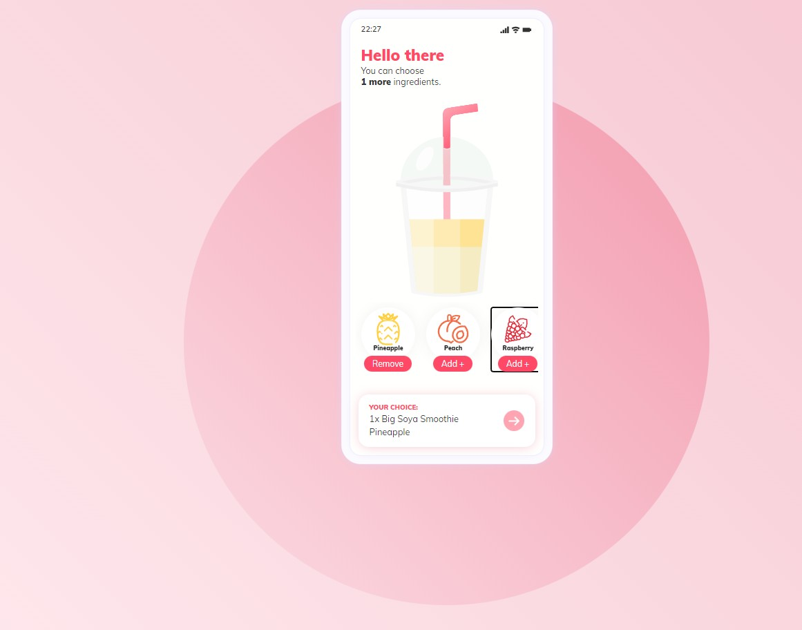 |
| [204.what-s-sharper-than-a-nacho-and-smoother-than-cheese-sauce](https://renatomportugal.github.io/04.template/204.what-s-sharper-than-a-nacho-and-smoother-than-cheese-sauce/) | |

## AnaliseDePalavra

|Links        |Telas        |
|---          |---          |
| [095.word-graphic](https://renatomportugal.github.io/04.template/095.word-graphic/) | |

## Animação

|Cavalo       |Telas        |
| [234.clip-clop-clippity-clop](https://renatomportugal.github.io/04.template/234.clip-clop-clippity-clop/) | |
| [259.muybridge-galloping-horse](https://renatomportugal.github.io/04.template/259.muybridge-galloping-horse/) | |
|Cachorro     |Telas        |
| [232.67puppy-s-night-time](https://renatomportugal.github.io/04.template/232.67puppy-s-night-time/) | |
| [243.boston-terrier-pure-css-image](https://renatomportugal.github.io/04.template/243.boston-terrier-pure-css-image/) | |
| [258.mochi-shiba-vuejs-svg-css-cute](https://renatomportugal.github.io/04.template/258.mochi-shiba-vuejs-svg-css-cute/) | |
| [355.dog](https://renatomportugal.github.io/04.template/355.dog/) | |
|Com CSS      |Telas        |
|---          |---          |
| [205.animal-crossing-isabelle-s-day-off-pure-css](https://renatomportugal.github.io/04.template/205.animal-crossing-isabelle-s-day-off-pure-css/) | |
| [206.nasa-saturn-v-rocket-animated-in-3d-using-only-css](https://renatomportugal.github.io/04.template/206.nasa-saturn-v-rocket-animated-in-3d-using-only-css/) | |
|Celular      |Telas        |
| [212.mobiltelefonens-evolution-svg-shape-morphing](https://renatomportugal.github.io/04.template/212.mobiltelefonens-evolution-svg-shape-morphing/) | |
| [359.css-scrolling-phone](https://renatomportugal.github.io/04.template/359.css-scrolling-phone/) | |
|Com Fala     |Telas        |
| [213.an-owl-trapped-in-the-instawasher](https://renatomportugal.github.io/04.template/213.an-owl-trapped-in-the-instawasher/) | |
|Coruja       |Telas        |
| [356.cute-owl-css-only](https://renatomportugal.github.io/04.template/356.cute-owl-css-only/) | |
|Costura      |Telas        |
| [214.nick-slater-svg-animated-by-kono](https://renatomportugal.github.io/04.template/214.nick-slater-svg-animated-by-kono/) | |
|Culinária    |Telas        |
| [215.last-glass](https://renatomportugal.github.io/04.template/215.last-glass/) | |
|Disney       |Telas        |
| [216.mickey-and-walt-codepenchallenge](https://renatomportugal.github.io/04.template/216.mickey-and-walt-codepenchallenge/) | |
| [217.pure-css-disney-castle](https://renatomportugal.github.io/04.template/217.pure-css-disney-castle/) | |
|Emoções      |Telas        |
| [218.emotional-character](https://renatomportugal.github.io/04.template/218.emotional-character/) | |
|Gato         |Telas        |
| [237.sleepingCat](https://renatomportugal.github.io/04.template/237.sleepingCat/) | |
| [238.with-your-eyes-closed](https://renatomportugal.github.io/04.template/238.with-your-eyes-closed/) | |
| [241.best-buddies-nappure-css](https://renatomportugal.github.io/04.template/241.best-buddies-nappure-css/) | |
| [242.bongo-cat-codes](https://renatomportugal.github.io/04.template/242.bongo-cat-codes/) | |
| [244.cat-illustration-with-animationpure-css](https://renatomportugal.github.io/04.template/244.cat-illustration-with-animationpure-css/) | |
| [251.cat-in-a-box](https://renatomportugal.github.io/04.template/251.cat-in-a-box/) | |
| [256.grumpy-cat](https://renatomportugal.github.io/04.template/256.grumpy-cat/) | |
| [261.window-cat](https://renatomportugal.github.io/04.template/261.window-cat/) | |
| [314.animated-cat-with-css](https://renatomportugal.github.io/04.template/314.animated-cat-with-css/) | |
|Girafa       |Telas        |
| [239.codevember-29giraffe](https://renatomportugal.github.io/04.template/239.codevember-29giraffe/) | |
|Google       |Telas        |
| [219.randomly-generated-css-lava-lamp-codepenchallenge](https://renatomportugal.github.io/04.template/219.randomly-generated-css-lava-lamp-codepenchallenge/) | |
|Literatura   |Telas        |
| [220.page-flip](https://renatomportugal.github.io/04.template/220.page-flip/) | |
|Mecânica     |Telas        |
| [221.only-css-gear](https://renatomportugal.github.io/04.template/221.only-css-gear/) | |
|Música       |Telas        |
| [222.LP](https://renatomportugal.github.io/04.template/222.LP/) | |
| [223.nick-slater-sf-airbnb-animated-by-kono](https://renatomportugal.github.io/04.template/223.nick-slater-sf-airbnb-animated-by-kono/) | |
|Pássaros     |Telas        |
| [230.birds](https://renatomportugal.github.io/04.template/230.birds/) | |
|Pessoas      |Telas        |
| [224.eincsstein](https://renatomportugal.github.io/04.template/224.eincsstein/) | |
| [226.vera-voishvilo-animated-svg-by-kono](https://renatomportugal.github.io/04.template/226.vera-voishvilo-animated-svg-by-kono/) | |
|Peixe        |Telas        |
| [252.codevember20curvy-koi-fish](https://renatomportugal.github.io/04.template/252.codevember20curvy-koi-fish/) | |
|Pintinhos    |Telas        |
| [254.eggs](https://renatomportugal.github.io/04.template/254.eggs/) | |
|Poesia       |Telas        |
| [227.poetry](https://renatomportugal.github.io/04.template/227.poetry/) | |
|Praia        |Telas        |
| [352.only-css-summer-dream](https://renatomportugal.github.io/04.template/352.only-css-summer-dream/) | |
|Programador  |Telas        |
| [225.the-mind-of-a-web-developer-pure-css-svg](https://renatomportugal.github.io/04.template/225.the-mind-of-a-web-developer-pure-css-svg/) | |
| [360.programmer](https://renatomportugal.github.io/04.template/360.programmer/) | |
|Rinoceronte  |Telas        |
| [255.farting-rhino](https://renatomportugal.github.io/04.template/255.farting-rhino/) | |
| [257.interactive-hippo-button](https://renatomportugal.github.io/04.template/257.interactive-hippo-button/) | |
|StarWars     |Telas        |
| [228.lightsaber](https://renatomportugal.github.io/04.template/228.lightsaber/) | |
|Trem         |Telas        |
| [229.moving-train-animation-pure-css](https://renatomportugal.github.io/04.template/229.moving-train-animation-pure-css/) | |
|Vaca         |Telas        |
| [240.purple-cow-pure-css](https://renatomportugal.github.io/04.template/240.purple-cow-pure-css/) | |

## Ano_Novo
|Animação           |Telas        |
| [249.happy-new-year-2020](https://renatomportugal.github.io/04.template/249.happy-new-year-2020/) | |
|Fogos de Artifício |Telas        |
|---                |---          |
| [247.dots-flocks](https://renatomportugal.github.io/04.template/247.dots-flocks/) | |
| [248.firework](https://renatomportugal.github.io/04.template/248.firework/) | |

## Aparelhos

|Calculadora  |Telas        |
|---          |---          |
| [096.Calculadora](https://renatomportugal.github.io/04.template/096.Calculadora/) | |
|Contador     |Telas        |
| [274.hand-tally-counter](https://renatomportugal.github.io/04.template/274.hand-tally-counter/) | |
|TV           |Telas        |
| [245.old-tv](https://renatomportugal.github.io/04.template/245.old-tv/) | |
| [246.pure-css-home-media-ambilighttry-the-lights](https://renatomportugal.github.io/04.template/246.pure-css-home-media-ambilighttry-the-lights/) | |

## Arduino

|Calculadora  |Telas        |
|---          |---          |
| [172.no-div-arduino-uno-with-lcd-display-and-animation](https://renatomportugal.github.io/04.template/172.no-div-arduino-uno-with-lcd-display-and-animation/) | |

## Arte

|Quadro       |Telas        |
|---          |---          |
| [434.Quadro](https://renatomportugal.github.io/04.template/434.Quadro/) | |

## Astronomia

|Links        |Telas        |
|---          |---          |
| [062.daylight-cycles-of-earth](https://renatomportugal.github.io/04.template/062.daylight-cycles-of-earth) | |

## Audio

|Click        |Telas        |
|---          |---          |
| [098.air-horns](https://renatomportugal.github.io/04.template/098.air-horns) | |
| [120.sound-links-menu](https://renatomportugal.github.io/04.template/120.sound-links-menu) | |

## Background
|Arte         |Telas        |
| [209.responsive-sine-cone-animation](https://renatomportugal.github.io/04.template/209.responsive-sine-cone-animation) | |
| [210.ro](https://renatomportugal.github.io/04.template/210.ro) | |
|Click        |Telas        |
|---          |---          |
| [116.carnaval](https://renatomportugal.github.io/04.template/116.carnaval) | |
|Click        |Telas        |
| [103.Lua](https://renatomportugal.github.io/04.template/103.Lua) | |
|Outros       |Telas        |
| [104.crossing-walls](https://renatomportugal.github.io/04.template/104.crossing-walls) | |
| [105.perticle-rotation-05](https://renatomportugal.github.io/04.template/105.perticle-rotation-05) | |
| [106.tunnel-ride-ii](https://renatomportugal.github.io/04.template/106.tunnel-ride-ii) | |
| [208.zim-domes-tribute-to-scifi-book-artists-codepen-challenge](https://renatomportugal.github.io/04.template/208.zim-domes-tribute-to-scifi-book-artists-codepen-challenge) | |

## Banner

|Click        |Telas        |
|---          |---          |
| [171.single-element-css-banner](https://renatomportugal.github.io/04.template/171.single-element-css-banner) | |

## Biologia

|Click        |Telas        |
|---          |---          |
| [250.global-warming](https://renatomportugal.github.io/04.template/250.global-warming) | |

## Bordados

|Click        |Telas        |
|---          |---          |
| [108.single-div-css-cross-stitch](https://renatomportugal.github.io/04.template/108.single-div-css-cross-stitch) | |

## Bordas

|Click        |Telas        |
|---          |---          |
| [109.dashed-border-generator](https://renatomportugal.github.io/04.template/109.dashed-border-generator) | |

## Busca

|Links        |Telas        |
|---          |---          |
| [059.searching-rod](https://renatomportugal.github.io/04.template/059.searching-rod) | |

## Camera

|Click        |Telas        |
|---          |---          |
| [423.camera-shutter](https://renatomportugal.github.io/04.template/423.camera-shutter) | |

## Canvas

|Links        |Telas        |
|---          |---          |
| [004.canvas-events-2011-08-22](https://renatomportugal.github.io/04.template/004.canvas-events-2011-08-22/) ||

## Cards

|Categoria        |Telas        |
|---          |---          |
| [066.product-sorter](https://renatomportugal.github.io/04.template/066.product-sorter/) |  |
|Hover            |Telas        |
| [113.services_tabs](https://renatomportugal.github.io/04.template/113.services_tabs/) |  |
|Outros           |Telas        |
| [114.card_styles](https://renatomportugal.github.io/04.template/114.card_styles/) |  |
| [115.information_cards](https://renatomportugal.github.io/04.template/115.information_cards/) |  |
|Não Resposivos   |Telas        |
| [117.chatroom-project](https://renatomportugal.github.io/04.template/117.chatroom-project/) |  |
| [151.shopping-ui](https://renatomportugal.github.io/04.template/151.shopping-ui/) |  |
| [118.chat-widget](https://renatomportugal.github.io/04.template/118.chat-widget/) |  |
|Resposivos       |Telas        |
| [119.elegant_bootstrap_4_message_chat_box_template](https://renatomportugal.github.io/04.template/119.elegant_bootstrap_4_message_chat_box_template/) |  |
| [266.flexi-bootstrap-thumbnail-cards-cards](https://renatomportugal.github.io/04.template/266.flexi-bootstrap-thumbnail-cards-cards/) |  |
|Prices           |Não Resposivos        |
| [150.pricing-table-design](https://renatomportugal.github.io/04.template/150.pricing-table-design/) |  |
|Blog             |Não Resposivos        |
| [264.article-card](https://renatomportugal.github.io/04.template/264.article-card/) |  |
|3D               |Não Resposivos        |
| [265.css-leaning-card-effect](https://renatomportugal.github.io/04.template/265.css-leaning-card-effect/) |  |

## Cartas

|Categoria        |Telas        |
|---          |---          |
| [267.css-aces](https://renatomportugal.github.io/04.template/267.css-aces/) |  |

## Cartaz

|Categoria        |Telas        |
|---          |---          |
| [268.css-folded-poster-effect](https://renatomportugal.github.io/04.template/268.css-folded-poster-effect/) |  |

## Catalogo

|Música       |Responsivo   |
|---          |---          |
| [163.the-great-ones](https://renatomportugal.github.io/04.template/163.the-great-ones/) |  |

## Click Select

|Links        |Telas        |
|---          |---          |
| [036.responsive-image-map-demo](https://renatomportugal.github.io/04.template/036.responsive-image-map-demo/) ||

## Código_Morse

|Links        |Telas        |
|---          |---          |
| [058.tgmtmorse](https://renatomportugal.github.io/04.template/058.tgmtmorse) | |
| [069.morse-code-alphabet](https://renatomportugal.github.io/04.template/069.morse-code-alphabet) | |

## Código_De_Barras

|Links        |Telas        |
|---          |---          |
| [273.barcode](https://renatomportugal.github.io/04.template/273.barcode/) |  |

## Color

|Picker       |Telas        |
|---          |---          |
| [133.isometric-color-picker](https://renatomportugal.github.io/04.template/133.isometric-color-picker/) |  |

## Console

|Links        |Telas        |
|---          |---          |
| [068.responsive-retro-crt-screen-with-border-image-and-gradient](https://renatomportugal.github.io/04.template/068.responsive-retro-crt-screen-with-border-image-and-gradient) | |
| [154.Console-master-2](https://renatomportugal.github.io/04.template/154.Console-master-2) | |
| [155.cssConsole-master](https://renatomportugal.github.io/04.template/155.cssConsole-master/examples) | |
| [156.javascript-sandbox-console-master](https://renatomportugal.github.io/04.template/156.javascript-sandbox-console-master) | |

## Controles

|Accordion         |Telas        |
| [180.css-responsive-animated-accordion](https://renatomportugal.github.io/04.template/180.css-responsive-animated-accordion) | |
| [181.pure-css-accordion](https://renatomportugal.github.io/04.template/181.pure-css-accordion) | |
|Botões            |Telas        |
| [127.buttonFuturistic](https://renatomportugal.github.io/04.template/127.buttonFuturistic) | |
| [129.jqueryswitch-2014-01-28](https://renatomportugal.github.io/04.template/129.jqueryswitch-2014-01-28) | |
| [130.social-app-menu](https://renatomportugal.github.io/04.template/130.social-app-menu) | |
|Botão de Like     |Telas        |
| [260.paw-clap-button](https://renatomportugal.github.io/04.template/260.paw-clap-button) | |
|Inibidor de Botão |Telas        |
| [235.cat-and-mouse](https://renatomportugal.github.io/04.template/235.cat-and-mouse) | |
|DropDown          |Telas        |
| [128.single-selectiondevextreme-jquery-drop-down-box](https://renatomportugal.github.io/04.template/128.single-selectiondevextreme-jquery-drop-down-box) | |

## Conversões

|Base64       |Telas        |
|---          |---          |
| [107.visualization-of-base64-encoding](https://renatomportugal.github.io/04.template/107.visualization-of-base64-encoding) | |

## Coordenadas

|Links        |Telas        |
|---          |---          |
| [030.mouse-xy-position](https://renatomportugal.github.io/04.template/030.mouse-xy-position/) |  |
| [013.einstein-relativity-codepen-stellar-scientists](https://renatomportugal.github.io/04.template/013.einstein-relativity-codepen-stellar-scientists/) ||
| [042.web-animations-sound-and-custom-cursor-mix](https://renatomportugal.github.io/04.template/042.web-animations-sound-and-custom-cursor-mix/) ||
| [002.animation-project](https://renatomportugal.github.io/04.template/002.animation-project/) ||
| [006.CodePen_Export_mapsv](https://renatomportugal.github.io/04.template/006.CodePen_Export_mapsv/) ||
| [009.crop-image-with-focus-point-cropper](https://renatomportugal.github.io/04.template/009.crop-image-with-focus-point-cropper/) ||
| [017.image-cropper-2012-07-04](https://renatomportugal.github.io/04.template/017.image-cropper-2012-07-04/) ||
| [027.linear-interp](https://renatomportugal.github.io/04.template/027.linear-interp/) ||
| [029.mouse-coord](https://renatomportugal.github.io/04.template/029.mouse-coord/) ||

## Covid

|Avatar       |Telas        |
|---          |---          |
| [276.pure-css-avatar](https://renatomportugal.github.io/04.template/276.pure-css-avatar/) |  |
|Campanha     |Telas        |
| [275.2020](https://renatomportugal.github.io/04.template/275.2020/) |  |

## CSS

|Links        |Telas        |
|---          |---          |
| [065.only-css-showcase-car](https://renatomportugal.github.io/04.template/065.only-css-showcase-car/) |  |
|Aprendizado  |Com Server   |
| [368.angular-interactive-box-model-diagram](https://renatomportugal.github.io/04.template/368.angular-interactive-box-model-diagram/) |  |
|Aprendizado  |Sem Server   |
| [369.bootstrap-navbar-toggle-animations](https://renatomportugal.github.io/04.template/369.bootstrap-navbar-toggle-animations/) |  |
| [370.padding-versus-margin-in-the-real-world](https://renatomportugal.github.io/04.template/370.padding-versus-margin-in-the-real-world/) |  |
| [371.percentage-unit-for-font-size](https://renatomportugal.github.io/04.template/371.percentage-unit-for-font-size/) |  |
| [372.percentage-unit-for-width-or-height](https://renatomportugal.github.io/04.template/372.percentage-unit-for-width-or-height/) |  |
|Background   |Telas        |
| [353.5-way-gradient-generator](https://renatomportugal.github.io/04.template/353.5-way-gradient-generator/) |  |
|Border       |Telas        |
| [354.css-gradient-border-cover-method-works-well-with-border-radius](https://renatomportugal.github.io/04.template/354.css-gradient-border-cover-method-works-well-with-border-radius/) |  |
|Color        |Contrast     |
| [373.c3-color-contrast-checker](https://renatomportugal.github.io/04.template/373.c3-color-contrast-checker/) |  |
| [374.css-grid-style-guide](https://renatomportugal.github.io/04.template/374.css-grid-style-guide/) | 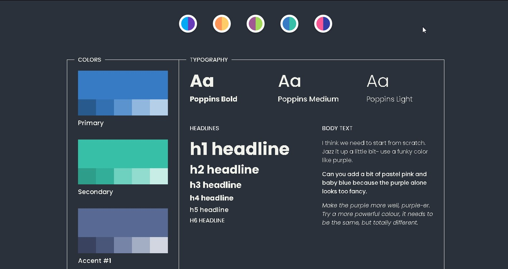 |
| [375.der-bunt-color-harmonies-alpha-1-1](https://renatomportugal.github.io/04.template/375.der-bunt-color-harmonies-alpha-1-1/) |  |
| [376.random-color-palette-generator-with-tinycolor-js](https://renatomportugal.github.io/04.template/376.random-color-palette-generator-with-tinycolor-js/) |  |
|Efeitos      |Telas        |
| [362.7-basic-animation-effects](https://renatomportugal.github.io/04.template/362.7-basic-animation-effects/) |  |
|Logo         |Telas        |
| [377.css-batman-logo](https://renatomportugal.github.io/04.template/377.css-batman-logo/) |  |
| [378.mern-stack-mongodb-express-js-react-js-node-js](https://renatomportugal.github.io/04.template/378.mern-stack-mongodb-express-js-react-js-node-js/) |  |
| [379.ubuntu](https://renatomportugal.github.io/04.template/379.ubuntu/) |  |
|Pessoa       |Telas        |
| [365.css-self-portrait](https://renatomportugal.github.io/04.template/365.css-self-portrait/) |  |
| [366.self-portrait-in-css](https://renatomportugal.github.io/04.template/366.self-portrait-in-css/) |  |
| [367.the-girl-with-a-p-e-a-r-l-css-earring](https://renatomportugal.github.io/04.template/367.the-girl-with-a-p-e-a-r-l-css-earring/) |  |
|Seletores    |Telas        |
| [361.css-selectors-cheatsheet](https://renatomportugal.github.io/04.template/361.css-selectors-cheatsheet/) |  |
|Shadow       |Telas        |
| [363.google-paper-shadows](https://renatomportugal.github.io/04.template/363.google-paper-shadows/) |  |
|Transform    |Telas        |
| [364.css-transform-functions-visualizer](https://renatomportugal.github.io/04.template/364.css-transform-functions-visualizer/) |  |

## Cursor

|Links        |Telas        |
|---          |---          |
| [278.cursors](https://renatomportugal.github.io/04.template/278.cursors/) |  |
| [279.custom-cursors-using-data-uri](https://renatomportugal.github.io/04.template/279.custom-cursors-using-data-uri/) |  |

## CV

|Responsivo   |Telas        |
|---          |---          |
| [157.a-minimalist-resume](https://renatomportugal.github.io/04.template/157.a-minimalist-resume/) |  |
| [158.resume](https://renatomportugal.github.io/04.template/158.resume/) |  |

## Dashboard

|Responsivo   |Telas                   |
|---          |---                     |
| [159.animating-charts-grid](https://renatomportugal.github.io/04.template/159.animating-charts-grid/) |  |
| [160.windows-8-metro-ui](https://renatomportugal.github.io/04.template/160.windows-8-metro-ui/) |  |
|Local não    |Funciona só em Servidor |
| [161.codepen_ajCxc](https://renatomportugal.github.io/04.template/161.codepen_ajCxc/) |  |
|Tarefas      |Telas                   |
| [319.task-manager-ui-with-css-grid](https://renatomportugal.github.io/04.template/319.task-manager-ui-with-css-grid/) |  |

## Data-Table

|Links          |Telas        |
|---            |---          |
|Não Responsivo |---          |
| [135.panel_tables_with_filter](https://renatomportugal.github.io/04.template/135.panel_tables_with_filter/) |  |
| [138.dashboard-with-webdatarocks-and-fusioncharts-dark-theme](https://renatomportugal.github.io/04.template/138.dashboard-with-webdatarocks-and-fusioncharts-dark-theme/) |  |
| [141.material-sortable-datatable](https://renatomportugal.github.io/04.template/141.material-sortable-datatable/) |  |
| [143.responsive-table-with-datatables](https://renatomportugal.github.io/04.template/143.responsive-table-with-datatables/) |  |
|Responsivo     |---          |
| [136.billionaires-responsive-table034-of-100days100projects](https://renatomportugal.github.io/04.template/136.billionaires-responsive-table034-of-100days100projects/) |  |
| [137.codepen_aLVXGO](https://renatomportugal.github.io/04.template/137.codepen_aLVXGO/) |  |
| [140.mantenimiento-simple-con-angular-material-y-lodash](https://renatomportugal.github.io/04.template/140.mantenimiento-simple-con-angular-material-y-lodash/) |  |
| [142.responsive-product-comparison-table](https://renatomportugal.github.io/04.template/142.responsive-product-comparison-table/) |  |
| [144.table2](https://renatomportugal.github.io/04.template/144.table2/) |  |

## Desenho

|Aprender     |Telas        |
|---          |---          |
| [280.eye](https://renatomportugal.github.io/04.template/280.eye/) |  |

## Diagrama_De_Força

|Links        |Telas        |
|---          |---          |
| [015.force-directed-diagram](https://renatomportugal.github.io/04.template/015.force-directed-diagram/) | |
| [024.it-system-interface-explorer](https://renatomportugal.github.io/04.template/024.it-system-interface-explorer/) | |
| [281.air-nz-force-diagram-of-directors-500-nodes](https://renatomportugal.github.io/04.template/281.air-nz-force-diagram-of-directors-500-nodes/) |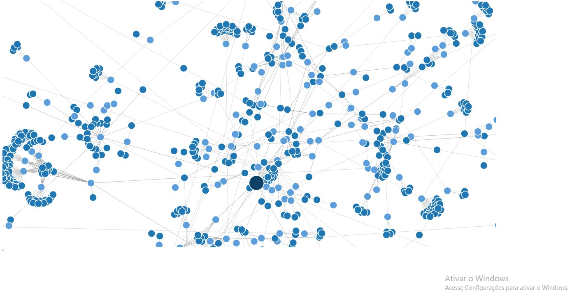 |
| [282.country-borders-force-diagram-d3](https://renatomportugal.github.io/04.template/282.country-borders-force-diagram-d3/) | |
| [283.d3-force-directed-node-link-diagram](https://renatomportugal.github.io/04.template/283.d3-force-directed-node-link-diagram/) | |
| [284.force-directed-diagram](https://renatomportugal.github.io/04.template/284.force-directed-diagram/) | |
| [335.mindmap](https://renatomportugal.github.io/04.template/335.mindmap/) | |
| [412.CodePen_Export_jOWMXye](https://renatomportugal.github.io/04.template/412.CodePen_Export_jOWMXye/) | |
| [415.d3-forcelayout](https://renatomportugal.github.io/04.template/415.d3-forcelayout/) | |
| [416.d3-mindmap](https://renatomportugal.github.io/04.template/416.d3-mindmap/) | |
| [417.mindmap](https://renatomportugal.github.io/04.template/417.mindmap/) |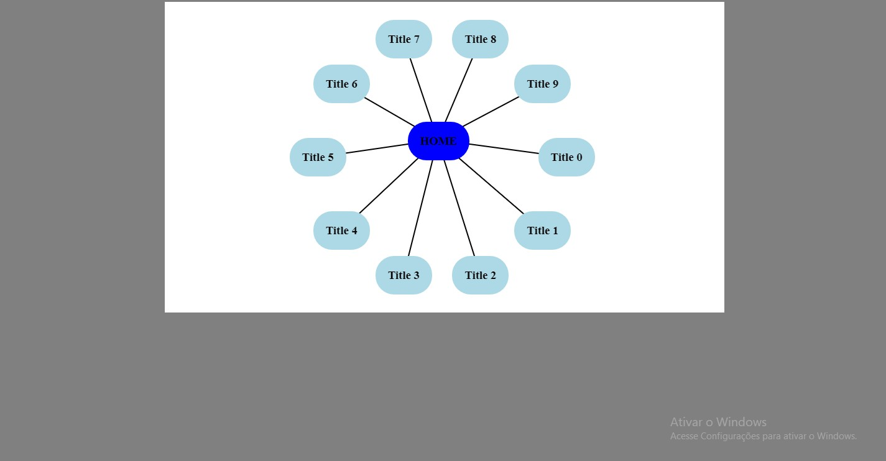 |

## Documentacao

|Não Responsivo |Telas        |
|---            |---          |
| [337.base-element](https://renatomportugal.github.io/04.template/337.base-element/) | |

## DOM

|Hierarquia     |Telas        |
|---            |---          |
| [339.charted](https://renatomportugal.github.io/04.template/339.charted/) | |

## DragDrop

|Links        |Telas        |
|---          |---          |
| [340.lappy](https://renatomportugal.github.io/04.template/340.lappy/) | |
|Só PC        |Telas        |
| [341.mindmap-draggable-exploration](https://renatomportugal.github.io/04.template/341.mindmap-draggable-exploration/) | |

## E-Commerce

|Links        |Telas        |
|---          |---          |
| [060.CodePen_Export_Nqwbmg](https://renatomportugal.github.io/04.template/060.CodePen_Export_Nqwbmg) | |
|Processo | Timeline   |
| [387.process-timeline](https://renatomportugal.github.io/04.template/387.process-timeline) |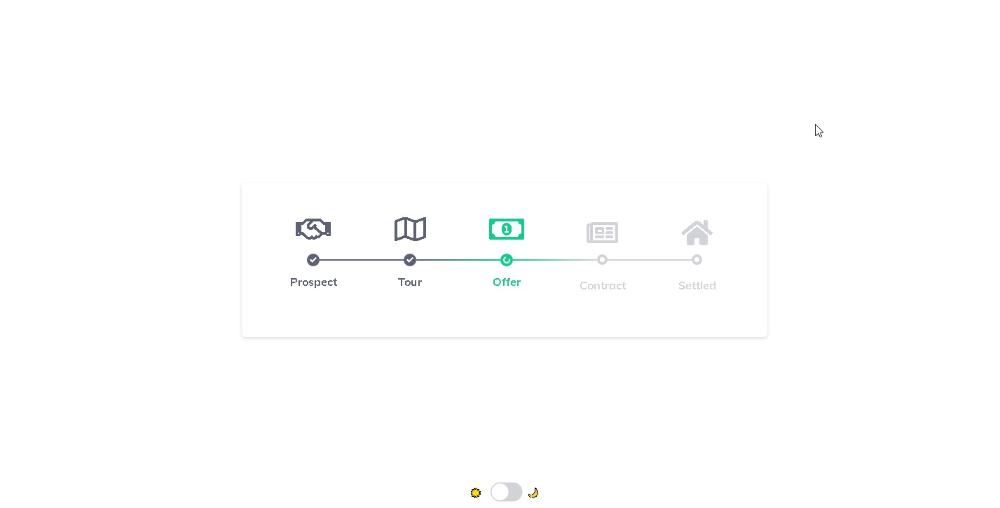 |
|Produtos | Responsivo |
| [326.bottle-of-text](https://renatomportugal.github.io/04.template/326.bottle-of-text) | |
| [380.ecommerce_product_detail](https://renatomportugal.github.io/04.template/380.ecommerce_product_detail) | |
| [381.product_shopping_grid_styles](https://renatomportugal.github.io/04.template/381.product_shopping_grid_styles) | |
|Produtos | Não Responsivo |
| [145.css-big-box-pc-games](https://renatomportugal.github.io/04.template/145.css-big-box-pc-games) | |
| [146.css-trapper-keeper-effect](https://renatomportugal.github.io/04.template/146.css-trapper-keeper-effect) | |
| [147.pricingpure-css16](https://renatomportugal.github.io/04.template/147.pricingpure-css16) | |
| [173.ui-to-code-1-juuce-app](https://renatomportugal.github.io/04.template/173.ui-to-code-1-juuce-app) | |
|Produtos | Detalhes - Responsivo |
| [383.move-spotlight-position](https://renatomportugal.github.io/04.template/383.move-spotlight-position) | |
|Produtos | Hover - Não Responsivo |
| [382.codepen_yeEXWN](https://renatomportugal.github.io/04.template/382.codepen_yeEXWN) | |
|Produtos | Escolha da Cor     |
| [385.pick-your-t-shirt-color](https://renatomportugal.github.io/04.template/385.pick-your-t-shirt-color) | |
|Tamanho      |Não Responsivo  |
| [152.xs-s-m-l-xl](https://renatomportugal.github.io/04.template/152.xs-s-m-l-xl) | |
|Tickets      |Responsivo      |
| [148.choose-ticketpure-css08](https://renatomportugal.github.io/04.template/148.choose-ticketpure-css08) | |
|Tickets      |Náo Responsivo      |
| [384.fun-with-css-counters-4-separate-the-increments](https://renatomportugal.github.io/04.template/384.fun-with-css-counters-4-separate-the-increments) | |
|Tickets      |Não Responsivo  |
| [149.folding-ticket-detail](https://renatomportugal.github.io/04.template/149.folding-ticket-detail) | |
|Serviços     |Responsivo |
| [179.css-grid-workout-schedule](https://renatomportugal.github.io/04.template/179.css-grid-workout-schedule) | |
|Refrigerante |Responsivo |
| [336.interactive-soft-drink-lid](https://renatomportugal.github.io/04.template/336.interactive-soft-drink-lid) | |

## E-Learning

|Testes          |Telas        |
|---             |---          |
| [388.verbal](https://renatomportugal.github.io/04.template/388.verbal) | |
| [389.animate-page-2013-06-13](https://renatomportugal.github.io/04.template/389.animate-page-2013-06-13) | |
| [390.Efeitos de Texto](https://renatomportugal.github.io/04.template/390.Efeitos de Texto) | |
|Notas de Lições |Telas        |
| [391.lesson-notes](https://renatomportugal.github.io/04.template/391.lesson-notes) | |

## Editor

|Links        |Telas        |
|---          |---          |
| [028.map-creator](https://renatomportugal.github.io/04.template/028.map-creator/) ||

## Emoji

|Links        |Telas        |
|---          |---          |
| [288.emoji-picker-on-textarea](https://renatomportugal.github.io/04.template/288.emoji-picker-on-textarea) |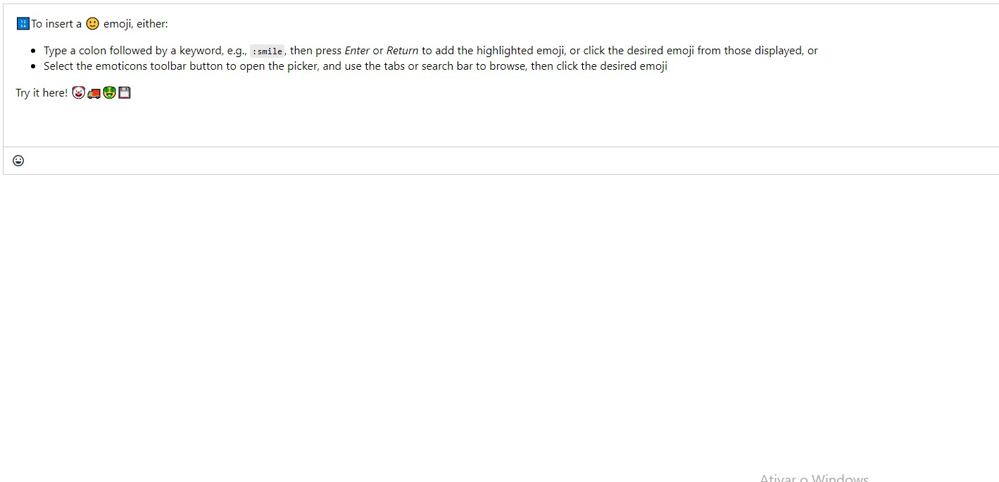 |

## Equipes

|Responsivo   |Telas        |
|---          |---          |
| [164.material-design-responsive-card](https://renatomportugal.github.io/04.template/164.material-design-responsive-card) | |
| [165.snap-it-like-thanos](https://renatomportugal.github.io/04.template/165.snap-it-like-thanos) | |

## Eventos

|Responsivo   |Telas        |
|---          |---          |
| [324.gdpr-are-you-ready-the-countdown-begins](https://renatomportugal.github.io/04.template/324.gdpr-are-you-ready-the-countdown-begins) | |
| [325.responsive-grid-timeline](https://renatomportugal.github.io/04.template/325.responsive-grid-timeline) | |

## Filmes_Series

|Matrix       |Telas        |
|---          |---          |
| [343.matrix-digital-rain-animated-version](https://renatomportugal.github.io/04.template/343.matrix-digital-rain-animated-version) | |
| [344.the-matrix-is-everywhere](https://renatomportugal.github.io/04.template/344.the-matrix-is-everywhere) | |
|Lost         |Telas        |
| [346.jqVintageTxt-master](https://renatomportugal.github.io/04.template/346.jqVintageTxt-master) | |

## Fluxograma

|Responsivo   |Telas        |
|---          |---          |
| [166.flowchart-gojs](https://renatomportugal.github.io/04.template/166.flowchart-gojs) | |

## Fonts

|Links        |Telas        |
|---          |---          |
| [064.old-paper](https://renatomportugal.github.io/04.template/064.old-paper) | |

## Formulários

|Links        |Telas        |
|---          |---          |
| [131.bootstrap-3-contact-form-with-validation](https://renatomportugal.github.io/04.template/131.bootstrap-3-contact-form-with-validation/) |  |
| [132.elegant-contact-form](https://renatomportugal.github.io/04.template/132.elegant-contact-form/) |  |
|Abelhas      |Telas        |
| [231.not-the-bees](https://renatomportugal.github.io/04.template/231.not-the-bees/) |  |
| [286.bootstrap_4_animated_dynamic_form](https://renatomportugal.github.io/04.template/286.bootstrap_4_animated_dynamic_form/) |  |

## Formulário_Físico

|Links        |Telas        |
|---          |---          |
| [287.solicitacao-de-ferias](https://renatomportugal.github.io/04.template/287.solicitacao-de-ferias/) |  |

## Fotos

|Puzze        |Telas        |
|---          |---          |
| [426.svg-pattern-jigsaw-puzzle-gallery-experiment](https://renatomportugal.github.io/04.template/426.svg-pattern-jigsaw-puzzle-gallery-experiment/) |  |
|Sombra       |Telas        |
| [427. image-drop-shadow-effects](https://renatomportugal.github.io/04.template/427. image-drop-shadow-effects/) |  |

## FPS

|Grava Tela   |Telas        |
|---          |---          |
| [322.lavalamp-image-shader](https://renatomportugal.github.io/04.template/322.lavalamp-image-shader/) |  |

## Fractal

|Mostra FPS   |Telas        |
|---          |---          |
| [323.canvas-tree](https://renatomportugal.github.io/04.template/323.canvas-tree/) |  |

## Galeria
|Flex            |Telas        |
|---             |---          |
| [429.thumbnail_gallery_modal_view_and_arrow_key_navigation](https://renatomportugal.github.io/04.template/429.thumbnail_gallery_modal_view_and_arrow_key_navigation/) |  |
| [430.easiest-masonry-grid-layout-tutorial](https://renatomportugal.github.io/04.template/430.easiest-masonry-grid-layout-tutorial/) |  |
| [431.grid-masonary](https://renatomportugal.github.io/04.template/431.grid-masonary/) |  |
|Filtro de Busca |Telas        |
| [428.pure-css-project-filter-tabs](https://renatomportugal.github.io/04.template/428.pure-css-project-filter-tabs/) |  |
|Template        |Telas        |
| [475.TemplateGaleria](https://renatomportugal.github.io/04.template/475.TemplateGaleria/) |  |

## Gradient_Generator

|Links        |Telas        |
|---          |---          |
| [174.5-way-gradient-generator](https://renatomportugal.github.io/04.template/174.5-way-gradient-generator/) |  |
| [270.proof-of-concept-chart-js-with-background-gradient](https://renatomportugal.github.io/04.template/270.proof-of-concept-chart-js-with-background-gradient/) |  |

## Gráficos

|Links        |Telas        |
|---          |---          |
| [269.amcharts-4-sankey-diagram](https://renatomportugal.github.io/04.template/269.amcharts-4-sankey-diagram/) |  |

## Grafo

|Links        |Telas        |
|---          |---          |
| [327.busca-em-profundidade](https://renatomportugal.github.io/04.template/327.busca-em-profundidade/) |  |

## Grid

|Links        |Telas        |
|---          |---          |
| [357.reusable-responsive-grids-1-2-3-3-2-3-1-3-all-css](https://renatomportugal.github.io/04.template/357.reusable-responsive-grids-1-2-3-3-2-3-1-3-all-css/) |  |

## HighLight

|Links        |Telas        |
|---          |---          |
| [457.SyntaxHighlighter](https://renatomportugal.github.io/04.template/457.SyntaxHighlighter/) |  |

## Hot_Relod

|Botões       |Telas        |
|---          |---          |
| [277.social-distancing-in-cs](https://renatomportugal.github.io/04.template/277.social-distancing-in-cs/) |  |

## Hover

|Botões       |Telas        |
|---          |---          |
| [110.fireflies](https://renatomportugal.github.io/04.template/110.fireflies/) |  |
| [317.bold-hover-animations-with-splitting-js](https://renatomportugal.github.io/04.template/317.bold-hover-animations-with-splitting-js/) |  |
| [318.custom-cursor-effect](https://renatomportugal.github.io/04.template/318.custom-cursor-effect/) |  |
| [358.product-mindmap](https://renatomportugal.github.io/04.template/358.product-mindmap/) |  |
|Link da Tela |Telas        |
|---          |---          |
| [386.portfolio-hover](https://renatomportugal.github.io/04.template/386.portfolio-hover/) |  |
| [392.link-fill-on-hover](https://renatomportugal.github.io/04.template/392.link-fill-on-hover/) |  |
|Link da Tela |Responsivo   |
|---          |---          |
| [393.bootstrap_4_our_services](https://renatomportugal.github.io/04.template/393.bootstrap_4_our_services/) |  |

## Idiomas

|Chinês       |Telas        |
|---          |---          |
| [347.learn-stroke-order-of-chinese-characters](https://renatomportugal.github.io/04.template/347.learn-stroke-order-of-chinese-characters/) |  |
|Coreano      |Telas        |
| [348.vinglish-vocab-flashcard-quiz](https://renatomportugal.github.io/04.template/348.vinglish-vocab-flashcard-quiz/) |  |

## IHM - Interface Homem Máquina

|Botões       |Telas        |
|---          |---          |
| [020.self-destruct-button](https://renatomportugal.github.io/04.template/020.self-destruct-button/) |  |
| [063.draggable-skeuomorph-switchtoggle](https://renatomportugal.github.io/04.template/063.draggable-skeuomorph-switchtoggle) | |
| [100.realistic-red-switch-pure-css](https://renatomportugal.github.io/04.template/100.realistic-red-switch-pure-css) | |
|Gauges       |Telas        |
| [121.barraHorizontal](https://renatomportugal.github.io/04.template/121.barraHorizontal/) |  |
| [122.circular1](https://renatomportugal.github.io/04.template/122.circular1/) |  |
| [123.circular2](https://renatomportugal.github.io/04.template/123.circular2/) |  |
| [124.circular3](https://renatomportugal.github.io/04.template/124.circular3/) |  |
| [125.Gauge](https://renatomportugal.github.io/04.template/125.Gauge/) |  |
| [126.ponteiro](https://renatomportugal.github.io/04.template/126.ponteiro/) |  |
|Mostrador Mecânico |Telas        |
| [101.mechincal-number-counter](https://renatomportugal.github.io/04.template/101.mechincal-number-counter/) |  |
|Mouse        |Telas        |
| [338.mouse-debugger](https://renatomportugal.github.io/04.template/338.mouse-debugger/) |  |
|Painéis      |Telas        |
| [102.apollo-agc-apollo-guidance-computer](https://renatomportugal.github.io/04.template/102.apollo-agc-apollo-guidance-computer/) |  |
|Slider       |Telas        |
| [349.neumorphic-light-switch](https://renatomportugal.github.io/04.template/349.neumorphic-light-switch/) |  |

## Imagem

|Efeito - Mouse |Telas        |
| [432.tsparticles-mouse-trail-unveiling-background](https://renatomportugal.github.io/04.template/432.tsparticles-mouse-trail-unveiling-background) | |
|Links - Mapeamento de Imagem |Telas        |
| [476.codepenchallenge-teaching-map-area](https://renatomportugal.github.io/04.template/476.codepenchallenge-teaching-map-area) | |
| [477.responsive-image-map-demo](https://renatomportugal.github.io/04.template/477.responsive-image-map-demo) | |
|Links - Mapeamento de Imagem - Editor |Telas        |
| [478.map-creator](https://renatomportugal.github.io/04.template/478.map-creator) | |
|Links - Mapeamento de Imagem - Hover |Telas        |
| [479.highlights-map-area-with-css-hover](https://renatomportugal.github.io/04.template/479.highlights-map-area-with-css-hover) | |
| [480.responsive-scalable-map](https://renatomportugal.github.io/04.template/480.responsive-scalable-map) |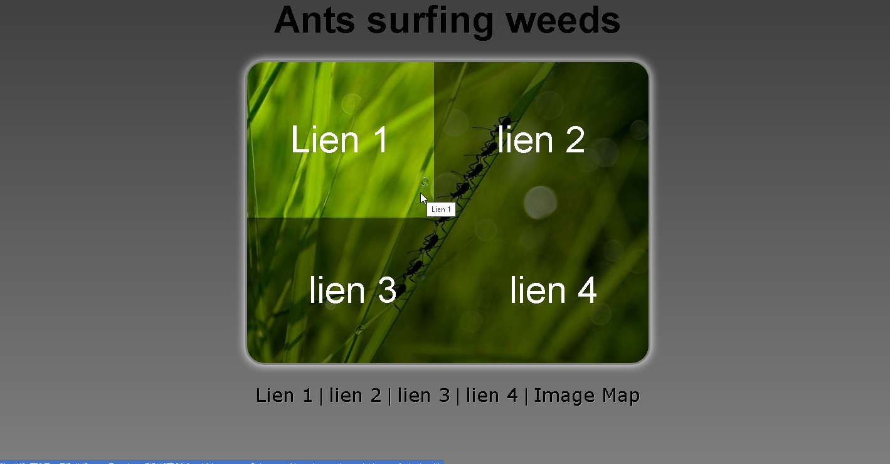 |
| [482.interactive-map-svg-leader-line-js-hammer-js](https://renatomportugal.github.io/04.template/482.interactive-map-svg-leader-line-js-hammer-js) | |
| [483.magnetic-hotspots-w-connecting-lines-gsap-pixi-js](https://renatomportugal.github.io/04.template/483.magnetic-hotspots-w-connecting-lines-gsap-pixi-js) | |
| [484.mapeamento](https://renatomportugal.github.io/04.template/484.mapeamento) | |
| [485.xkcd-1501-image-map](https://renatomportugal.github.io/04.template/485.xkcd-1501-image-map) | |
|Links - Mapeamento de Imagem - Polyline |Telas        |
| [481.Javascript-Image-Map-Generator-master](https://renatomportugal.github.io/04.template/481.Javascript-Image-Map-Generator-master) |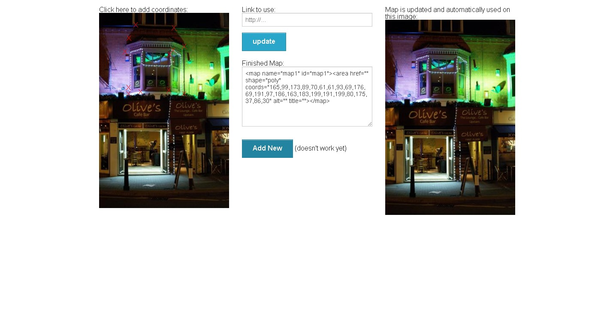 |
|Upload Preview |Telas        |
| [435.knockout-js-html5-file-bindings-with-upload-preview-and-drag-and-drop](https://renatomportugal.github.io/04.template/435.knockout-js-html5-file-bindings-with-upload-preview-and-drag-and-drop) | |
| [436.jquery-image-upload-preview](https://renatomportugal.github.io/04.template/436.jquery-image-upload-preview) | |
| [437.image-upload-preview_2](https://renatomportugal.github.io/04.template/437.image-upload-preview_2) | |
| [438.image-upload-preview](https://renatomportugal.github.io/04.template/438.image-upload-preview) | |
| [439.file-upload-preview-image](https://renatomportugal.github.io/04.template/439.file-upload-preview-image) | |
|Upload Zoom    |Telas        |
| [440.amplify-master](https://renatomportugal.github.io/04.template/440.amplify-master) | |
| [441.elevateweb-elevatezoom-f6bc619](https://renatomportugal.github.io/04.template/441.elevateweb-elevatezoom-f6bc619) | |
| [442.i-like-robots-EasyZoom-be809bf](https://renatomportugal.github.io/04.template/442.i-like-robots-EasyZoom-be809bf) | |
| [443.iviewer-0.7.11](https://renatomportugal.github.io/04.template/443.iviewer-0.7.11) | |
| [444.jackmoore-zoom-7a52232](https://renatomportugal.github.io/04.template/444.jackmoore-zoom-7a52232) | |
| [445.zoom.js-master](https://renatomportugal.github.io/04.template/445.zoom.js-master) | |

## Imagem_Camadas

|Links        |Telas        |
|---          |---          |
| [032.photo-id](https://renatomportugal.github.io/04.template/032.photo-id/) ||
| [016.handling-user-uploaded-images-by-derya](https://renatomportugal.github.io/04.template/016.handling-user-uploaded-images-by-derya/) ||
| [043.xlayers-2013-08-02](https://renatomportugal.github.io/04.template/043.xlayers-2013-08-02/) ||
| [044.z-index-and-stacking-context](https://renatomportugal.github.io/04.template/044.z-index-and-stacking-context/) ||
| [045.z-index-sass-management](https://renatomportugal.github.io/04.template/045.z-index-sass-management/) ||

## Imagem_Cortar_Subir_Salvar

|Links        |Telas        |
|---          |---          |
| [034.practice-003crop-image](https://renatomportugal.github.io/04.template/034.practice-003crop-image/) ||

## Imagem_Corte

|Links        |Telas        |
|---          |---          |
| [018.image-cropper-prototype](https://renatomportugal.github.io/04.template/018.image-cropper-prototype/) ||
| [040.vue_image-crop](https://renatomportugal.github.io/04.template/040.vue_image-crop/) ||
| [007.crop-image](https://renatomportugal.github.io/04.template/007.crop-image/) ||

## Imagem_Corte_Base64

|Links        |Telas        |
|---          |---          |
| [003.browser-image-crop](https://renatomportugal.github.io/04.template/003.browser-image-crop/) ||
| [010.cropper-try](https://renatomportugal.github.io/04.template/010.cropper-try/) ||
| [011.croppie-modal-error](https://renatomportugal.github.io/04.template/011.croppie-modal-error/) ||

## Imagem_Corte_Com_Mascara

|Links        |Telas        |
|---          |---          |
| [008.crop-image-using-svg](https://renatomportugal.github.io/04.template/008.crop-image-using-svg/) ||

## Imagem_Mapeamento

|Links        |Telas        |
|---          |---          |
| [021.impact-summary-map-template-js-master](https://renatomportugal.github.io/04.template/021.impact-summary-map-template-js-master/) ||

## Infográfico

|Links        |Telas        |
|---          |---          |
| [023.infografico-json](https://renatomportugal.github.io/04.template/023.infografico-json/) | |
| [035.pure-css-circles-infographic-JSON](https://renatomportugal.github.io/04.template/035.pure-css-circles-infographic-JSON/) | |
| [037.responsive-infographic-css-variables-grid.JSON](https://renatomportugal.github.io/04.template/037.responsive-infographic-css-variables-grid.JSON/) | |
| [450.interactive-svg-with-popups-and-micro-animations](https://renatomportugal.github.io/04.template/450.interactive-svg-with-popups-and-micro-animations) | |
| [449.courses-page-concept](https://renatomportugal.github.io/04.template/449.courses-page-concept) | |
| [451.pure-css-circles-infographic](https://renatomportugal.github.io/04.template/451.pure-css-circles-infographic) | |
| [452.responsive-infographic-css-variables-grid](https://renatomportugal.github.io/04.template/452.responsive-infographic-css-variables-grid) | |
| [452.responsive-infographic-css-variables-grid](https://renatomportugal.github.io/04.template/452.responsive-infographic-css-variables-grid) | |
| [454.timeline-of-html](https://renatomportugal.github.io/04.template/454.timeline-of-html) | |
| [455.vertical-left-and-right-timeline](https://renatomportugal.github.io/04.template/455.vertical-left-and-right-timeline) | |
|Surf         |Telas        |
| [271.surf-world-league](https://renatomportugal.github.io/04.template/271.surf-world-league) | |
|JSON - CORS  |Telas        |
| [446.infografico-json](https://renatomportugal.github.io/04.template/446.infografico-json) | |
| [447.pure-css-circles-infographic-JSON](https://renatomportugal.github.io/04.template/447.pure-css-circles-infographic-JSON) | |
| [448.responsive-infographic-css-variables-grid.JSON](https://renatomportugal.github.io/04.template/448.responsive-infographic-css-variables-grid.JSON) | |

## Inteligencia_Artificial

|Links        |Telas        |
| [433.hypermorph-3000](https://renatomportugal.github.io/04.template/433.hypermorph-3000) | |

## Javascript

|Loader       |Telas        |
| [456.loader-2012-12-27](https://renatomportugal.github.io/04.template/456.loader-2012-12-27) |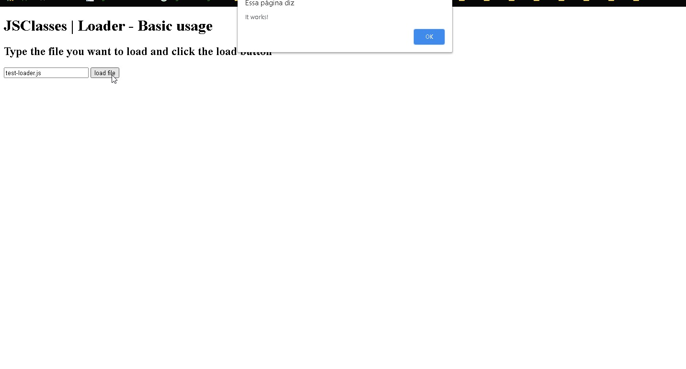 |
|Contador     |Telas        |
| [458.tweenmax-countto](https://renatomportugal.github.io/04.template/458.tweenmax-countto) | |

## Jogos
|Arkanoid            |Telas        |
| [459.block-breaking](https://renatomportugal.github.io/04.template/459.block-breaking) | |
|Apenas a Tela       |Telas        |
| [472.streetFighter](https://renatomportugal.github.io/04.template/472.streetFighter) | |
|Forca               |Telas        |
| [460.plankman-a-css-game](https://renatomportugal.github.io/04.template/460.plankman-a-css-game) | |
|Guitar Hero - CORS  |Telas        |
| [461.sonorous-string-master](https://renatomportugal.github.io/04.template/461.sonorous-string-master) | |
|Habilidades Manuais |Telas        |
| [466.js-lock-picking-game](https://renatomportugal.github.io/04.template/466.js-lock-picking-game) | |
|Marcador de Energia |Telas        |
| [465.fight](https://renatomportugal.github.io/04.template/465.fight) |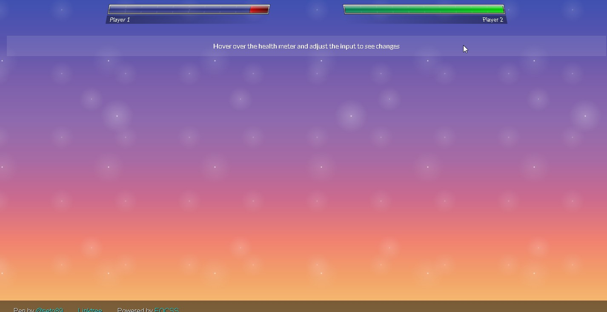 |
|Memória             |Telas        |
| [467.memodeck-fully-responsive](https://renatomportugal.github.io/04.template/467.memodeck-fully-responsive) | |
| [468.memory](https://renatomportugal.github.io/04.template/468.memory) | |
| [470.html5-canvas-puzzle-2012-02-18](https://renatomportugal.github.io/04.template/470.html5-canvas-puzzle-2012-02-18) | |
|Personagens         |Telas        |
| [469.day-2-character-design-with-css-variables](https://renatomportugal.github.io/04.template/469.day-2-character-design-with-css-variables) | |
|Roda a Roda         |Telas        |
| [471.jquery-spin-wheel-2011-06-09](https://renatomportugal.github.io/04.template/471.jquery-spin-wheel-2011-06-09) | |
|Tabuleiro           |Telas        |
| [473.css-mastermind](https://renatomportugal.github.io/04.template/473.css-mastermind) | |

## KeyGen

|Links        |Telas        |
|---          |---          |
| [097.KeyGen](https://renatomportugal.github.io/04.template/097.KeyGen) | |

## Layout

|Links        |Telas        |
|---          |---          |
| [067.pyramid-layout](https://renatomportugal.github.io/04.template/067.pyramid-layout) | |

## Landing_Page

|Links        |Telas        |
|---          |---          |
| [061.codepenchallenge-typeset-this-post](https://renatomportugal.github.io/04.template/061.codepenchallenge-typeset-this-post) | |

## Lista de Pessoas

|Links          |Telas        |
|---            |---          |
| [039.user-list-with-quick-search](https://renatomportugal.github.io/04.template/039.user-list-with-quick-search/) ||
| [001.alan-sugar-s-fired-employeesvue-transitions-challenge](https://renatomportugal.github.io/04.template/001.alan-sugar-s-fired-employeesvue-transitions-challenge/) ||
| [033.police-academy-characters](https://renatomportugal.github.io/04.template/033.police-academy-characters/) ||
| [038.tabs-navigation-ui](https://renatomportugal.github.io/04.template/038.tabs-navigation-ui/) ||
| [041.vuetify-avatars-group](https://renatomportugal.github.io/04.template/041.vuetify-avatars-group/) ||
|Não Responsivo |Telas        |
| [316.turning-pages-with-css](https://renatomportugal.github.io/04.template/316.turning-pages-with-css) | |
| [316.turning-pages-with-css](https://renatomportugal.github.io/04.template/316.turning-pages-with-css) | |
| [394.alan-sugar-s-fired-employeesvue-transitions-challenge](https://renatomportugal.github.io/04.template/394.alan-sugar-s-fired-employeesvue-transitions-challenge) | |
| [395.avatars-draggable-filter](https://renatomportugal.github.io/04.template/395.avatars-draggable-filter) | |
| [396.menu-1](https://renatomportugal.github.io/04.template/396.menu-1) | |
| [398.ui-profile-list](https://renatomportugal.github.io/04.template/398.ui-profile-list) | |
| [401.vuetify-avatars-group](https://renatomportugal.github.io/04.template/401.vuetify-avatars-group) | |
|Responsivo |Telas        |
| [397.police-academy-characters](https://renatomportugal.github.io/04.template/397.police-academy-characters) | |
| [399.user-list](https://renatomportugal.github.io/04.template/399.user-list) |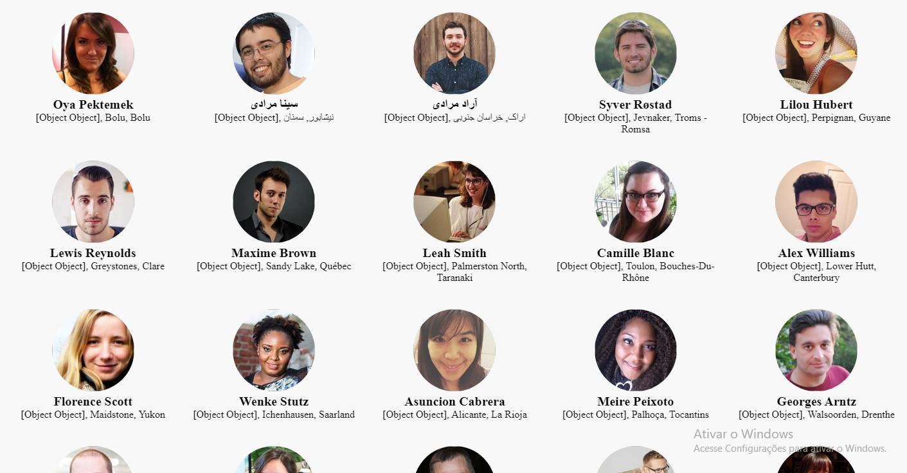 |
| [400.user-list-with-quick-search](https://renatomportugal.github.io/04.template/400.user-list-with-quick-search) | |

## Livros

|Links        |Telas        |
|---          |---          |
| [315.book-layout](https://renatomportugal.github.io/04.template/315.book-layout) | |
| [316.turning-pages-with-css](https://renatomportugal.github.io/04.template/316.turning-pages-with-css) | |

## Loader

|Links        |Telas        |
|---          |---          |
| [328.css3-loader-spinners](https://renatomportugal.github.io/04.template/328.css3-loader-spinners) | |

## Login

|Links        |Telas        |
|---          |---          |
| [329.slide-sign-in-sign-up-form](https://renatomportugal.github.io/04.template/329.slide-sign-in-sign-up-form) | |

## Mapeamento_De_Processos

|Links        |Telas        |
|---          |---          |
| [330.CodePen_Export_gqzjeE](https://renatomportugal.github.io/04.template/330.CodePen_Export_gqzjeE) | |

## Mensagem

|Chat         |Telas        |
|---          |---          |
| [272.apple-imessage-in-css](https://renatomportugal.github.io/04.template/272.apple-imessage-in-css) | |

## Menu

|Blur           |Telas        |
|---            |---          |
| [486.dynamic-inside-blur-pure-css](https://renatomportugal.github.io/04.template/486.dynamic-inside-blur-pure-css) | |
|Botão Suspenso |Telas        |
| [487.circular-navigation-button](https://renatomportugal.github.io/04.template/487.circular-navigation-button) | |
|Hover - Só PC  |Telas        |
| [488.menu-hover-slide-fill](https://renatomportugal.github.io/04.template/488.menu-hover-slide-fill) | |
|Ícones         |Telas        |
| [489.cpc-a-part-of-the-page-navigation](https://renatomportugal.github.io/04.template/489.cpc-a-part-of-the-page-navigation) | |
|Setorial       |Telas        |
| [490.grid-navigation](https://renatomportugal.github.io/04.template/490.grid-navigation) | |
|Sobreposto     |Telas        |
| [491.dls-scroll-nav](https://renatomportugal.github.io/04.template/491.dls-scroll-nav) | |
|Subitens       |Telas        |
| [492.mindmap-menu](https://renatomportugal.github.io/04.template/492.mindmap-menu) | |
|Telas          |Telas        |
| [492.mindmap-menu](https://renatomportugal.github.io/04.template/492.mindmap-menu) | |

## Mind_Map

|Links        |Telas        |
|---          |---          |
| [413.CodePen_Export_MWwRKwL](https://renatomportugal.github.io/04.template/413.CodePen_Export_MWwRKwL) | |
| [414.css-outline](https://renatomportugal.github.io/04.template/414.css-outline) | |
| [418.mind-map](https://renatomportugal.github.io/04.template/418.mind-map) | |
| [420.tree-diagram](https://renatomportugal.github.io/04.template/420.tree-diagram) | |
| [421.vue-vue-mindmap](https://renatomportugal.github.io/04.template/421.vue-vue-mindmap) | |

## Mobile

|Links        |Telas        |
|---          |---          |
| [422.take-out-me](https://renatomportugal.github.io/04.template/422.take-out-me) | |

## Mouse

|Cavalo       |Telas        |
|---          |---          |
| [233.bojack-s-face-animated-w-gsap](https://renatomportugal.github.io/04.template/233.bojack-s-face-animated-w-gsap) | |

## Musica

|Links        |Telas        |
|---          |---          |
| [331.challenge-take-on-me](https://renatomportugal.github.io/04.template/331.challenge-take-on-me) | |
|CORS         |Telas        |
| [462.boombox](https://renatomportugal.github.io/04.template/462.boombox) | |
| [463.rapid-click](https://renatomportugal.github.io/04.template/463.rapid-click) |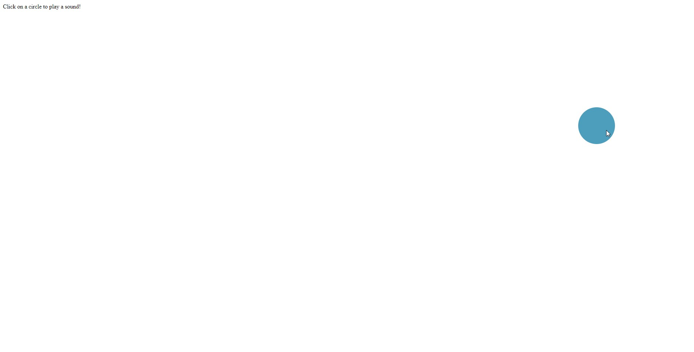 |
| [464.track-mixer](https://renatomportugal.github.io/04.template/464.track-mixer) | |

## Neon

|404          |Telas        |
|---          |---          |
| [176.neon404-page-not-found](https://renatomportugal.github.io/04.template/176.neon404-page-not-found/) | |
|Arco-íris    |Telas        |
| [262.configurable-glowing-rainbow-react-component](https://renatomportugal.github.io/04.template/262.configurable-glowing-rainbow-react-component/) | |

## Noticiario

|FoxNews      |Telas        |
|---            |---          |
| [332.fox-news-tv-display](https://renatomportugal.github.io/04.template/332.fox-news-tv-display/) | |
|Não Responsivo |Telas        |
| [333.news-ticker](https://renatomportugal.github.io/04.template/333.news-ticker/) | |

## Organograma

|Links        |Telas        |
|---          |---          |
| [012.Cursos](https://renatomportugal.github.io/04.template/012.Cursos/) ||
| [342.gojs-vue](https://renatomportugal.github.io/04.template/342.gojs-vue/) | |
|JSON         |Telas        |
| [494.Organograma_JSON](https://renatomportugal.github.io/04.template/494.Organograma_JSON/) | |
| [495.CodePen_Export_MWKLadq](https://renatomportugal.github.io/04.template/495.CodePen_Export_MWKLadq/) | |
| [496.CodePen_Export_VaewJE](https://renatomportugal.github.io/04.template/496.CodePen_Export_VaewJE/) | |
| [497.editable-mindmap](https://renatomportugal.github.io/04.template/497.editable-mindmap/) | |
| [498.node-list](https://renatomportugal.github.io/04.template/498.node-list/) | |
| [499.organo](https://renatomportugal.github.io/04.template/499.organo/) | |

## Pascoa
|Links        |Telas        |
|---          |---          |
| [253.easter-rabbit](https://renatomportugal.github.io/04.template/253.easter-rabbit) | |

## Paint_Brush
|Links        |Telas        |
|---          |---          |
| [112.native-js-day-8-drawing-canvas](https://renatomportugal.github.io/04.template/112.native-js-day-8-drawing-canvas) | |

## Perfil
|Avatar       |Telas        |
|---          |---          |
| [500.crop-image-with-croppie-modal](https://renatomportugal.github.io/04.template/500.crop-image-with-croppie-modal) | |
| [501.croppie-php](https://renatomportugal.github.io/04.template/501.croppie-php) | |
|Contato       |Telas        |
| [502.vue-material-design-card-prototype](https://renatomportugal.github.io/04.template/502.vue-material-design-card-prototype) | |
|Tabs          |Telas        |
| [503.tabs-navigation-ui](https://renatomportugal.github.io/04.template/503.tabs-navigation-ui) | |
|Perfil        |Telas        |
| [504.3-user-profile](https://renatomportugal.github.io/04.template/504.3-user-profile) | |
| [505.css-grid-profile-page-a-tribute-to-lin-manuel-miranda](https://renatomportugal.github.io/04.template/505.css-grid-profile-page-a-tribute-to-lin-manuel-miranda) | |
| [506.personalwebsite](https://renatomportugal.github.io/04.template/506.personalwebsite) | |
| [507.profile-card-ui](https://renatomportugal.github.io/04.template/507.profile-card-ui) | |
| [508.tribute-page](https://renatomportugal.github.io/04.template/508.tribute-page) | |

## Preview de Upload

|Links        |Telas        |
|---          |---          |
| [014.file-upload-preview-image](https://renatomportugal.github.io/04.template/014.file-upload-preview-image/) ||
| [019.image-upload-preview](https://renatomportugal.github.io/04.template/019.image-upload-preview/) ||
| [025.jquery-image-upload-preview](https://renatomportugal.github.io/04.template/025.jquery-image-upload-preview/) ||
| [026.knockout-js-html5-file-bindings-with-upload-preview-and-drag-and-drop](https://renatomportugal.github.io/04.template/026.knockout-js-html5-file-bindings-with-upload-preview-and-drag-and-drop/) ||

## Pre-Requisitos

|Links        |Telas        |
|---          |---          |
| [345.carrera-y-previas-gojs](https://renatomportugal.github.io/04.template/345.carrera-y-previas-gojs) | |

## Progress_Bar

|Radial       |Telas        |
|---          |---          |
| [334.radial-animated-progress-2](https://renatomportugal.github.io/04.template/334.radial-animated-progress-2) | |

## Responsivo

|Links        |Telas        |
|---          |---          |
| [005.chrome-bug-blurry-stops-when-more-than-8-colors](https://renatomportugal.github.io/04.template/005.chrome-bug-blurry-stops-when-more-than-8-colors/) ||
| [031.padding-versus-margin-in-the-real-world](https://renatomportugal.github.io/04.template/031.padding-versus-margin-in-the-real-world/) ||

## Ribbon

|Links        |Telas        |
|---          |---          |
| [153.css-ribbon](https://renatomportugal.github.io/04.template/153.css-ribbon) | |
| [167.corner-ribbons](https://renatomportugal.github.io/04.template/167.corner-ribbons) | |
| [168.css-clip-path-ribbons](https://renatomportugal.github.io/04.template/168.css-clip-path-ribbons) | |
| [169.demo-pure-css-corner-ribbon](https://renatomportugal.github.io/04.template/169.demo-pure-css-corner-ribbon) | |
| [170.pure-css-corner-ribbon](https://renatomportugal.github.io/04.template/170.pure-css-corner-ribbon) | |
| [424.css-fizzbuzz](https://renatomportugal.github.io/04.template/424.css-fizzbuzz) | |
| [425.ez-e-learning](https://renatomportugal.github.io/04.template/425.ez-e-learning) | |

## Scroll

|Links        |Telas        |
|---          |---          |
| [408.css-scroll-behavior-scroll-snap-type-mix-blend-mode](https://renatomportugal.github.io/04.template/408.css-scroll-behavior-scroll-snap-type-mix-blend-mode) | |
| [409.scrolling-animationsshow-recommendations](https://renatomportugal.github.io/04.template/409.scrolling-animationsshow-recommendations) | |
| [410.svg-overlay-pinned-section](https://renatomportugal.github.io/04.template/410.svg-overlay-pinned-section) | |
| [411.webpage-scrolling-experiment](https://renatomportugal.github.io/04.template/411.webpage-scrolling-experiment) | |

## Scroll_Infinito

|Links        |Telas        |
|---          |---          |
| [022.infinity-scroll-with-angularjs](https://renatomportugal.github.io/04.template/022.infinity-scroll-with-angularjs/) ||
| [403.css-html-jsinfinity-scroll-timeline](https://renatomportugal.github.io/04.template/403.css-html-jsinfinity-scroll-timeline) | |
| [404.infinite-scroll](https://renatomportugal.github.io/04.template/404.infinite-scroll) | |
| [405.infinity-scroll](https://renatomportugal.github.io/04.template/405.infinity-scroll) | |
| [407.jquery-mobile-infinite-scroll](https://renatomportugal.github.io/04.template/407.jquery-mobile-infinite-scroll) | |
|Só no PC     |Telas        |
| [402.simple-masonry-gallery-with-infinity-scroll](https://renatomportugal.github.io/04.template/402.simple-masonry-gallery-with-infinity-scroll) | |

## Slide

|Automático   |Telas        |
|---          |---          |
| [350.carousel](https://renatomportugal.github.io/04.template/350.carousel) | |
| [351.client_or_partners_logo_slider](https://renatomportugal.github.io/04.template/351.client_or_partners_logo_slider) | |

## SVG

|Animação     |Telas        |
|---          |---          |
| [509.isometric-floating-layers-svg](https://renatomportugal.github.io/04.template/509.isometric-floating-layers-svg) | |
| [510.sugar-rush-candyland](https://renatomportugal.github.io/04.template/510.sugar-rush-candyland) | |
| [511.svg-transform-origin](https://renatomportugal.github.io/04.template/511.svg-transform-origin) | |
|Corner       |Telas        |
| [512.simple-add-round-corners-to-svg-path-using-quadratic-line-type](https://renatomportugal.github.io/04.template/512.simple-add-round-corners-to-svg-path-using-quadratic-line-type) | |
|Editor       |Telas        |
| [513.svg-path-editor](https://renatomportugal.github.io/04.template/513.svg-path-editor) | |
|Figuras      |Telas        |
| [514.construct-and-move-svg-figure](https://renatomportugal.github.io/04.template/514.construct-and-move-svg-figure) | |
| [515.generate-svg-polygons](https://renatomportugal.github.io/04.template/515.generate-svg-polygons) | |
| [516.point-out-svg-objects-from-the-text-and-group-them-into-as-many-categories-as-you-want](https://renatomportugal.github.io/04.template/516.point-out-svg-objects-from-the-text-and-group-them-into-as-many-categories-as-you-want) | |
|Pinturas     |Telas        |
| [517.a-css-portrait-of-ada-lovelace](https://renatomportugal.github.io/04.template/517.a-css-portrait-of-ada-lovelace) | |
| [518.pure-css-frida-kahlo](https://renatomportugal.github.io/04.template/518.pure-css-frida-kahlo) | |
| [519.still-life-with-pears-pencil-illustration-as-svg](https://renatomportugal.github.io/04.template/519.still-life-with-pears-pencil-illustration-as-svg) | |

## Taxonomia

|Etiquetas        |Telas        |
|---          |---          |
| [320.bookmarks-play](https://renatomportugal.github.io/04.template/320.bookmarks-play) | |

## Testes

|Links        |Telas        |
|---          |---          |
| [162.technical-page](https://renatomportugal.github.io/04.template/162.technical-page) | |

## Texto

|Autocomplete |Telas        |
|---          |---          |
| [099.autocomplete](https://renatomportugal.github.io/04.template/099.autocomplete) | |

## Timeline

|Horizontal        |Telas        |
|---               |---          |
| [099.autocomplete](https://renatomportugal.github.io/04.template/099.autocomplete) | |
| [291.building-a-horizontal-timeline-with-css-and-javascript](https://renatomportugal.github.io/04.template/291.building-a-horizontal-timeline-with-css-and-javascript) | |
| [292.horizontal-timeline](https://renatomportugal.github.io/04.template/292.horizontal-timeline) | |
| [293.responsive-horizontal-timeline-using-slick-1-9-0-bootstrap-4-3-1](https://renatomportugal.github.io/04.template/293.responsive-horizontal-timeline-using-slick-1-9-0-bootstrap-4-3-1) | |
|Horizontal Click  |Telas        |
| [294.horizontal-timeline](https://renatomportugal.github.io/04.template/294.horizontal-timeline) | |
| [295.horizontal-timeline-2](https://renatomportugal.github.io/04.template/295.horizontal-timeline-2) | |
| [296.nested-color-coded-interactive-timeline](https://renatomportugal.github.io/04.template/296.nested-color-coded-interactive-timeline) | |
| [297.timeline (6)](https://renatomportugal.github.io/04.template/297.timeline (6)) | |
| [298.timeline-slider](https://renatomportugal.github.io/04.template/298.timeline-slider) | |
|Horizontal Hover  |Telas        |
| [299.animated-circle-timeline](https://renatomportugal.github.io/04.template/299.animated-circle-timeline) | |
|Vertical          |Telas        |
|---               |---          |
| [300.bitcoin-timeline-with-fixed-header-using-flexbox](https://renatomportugal.github.io/04.template/300.bitcoin-timeline-with-fixed-header-using-flexbox) | |
| [301.bootstrap-timeline](https://renatomportugal.github.io/04.template/301.bootstrap-timeline) | |
| [302.css-timeline](https://renatomportugal.github.io/04.template/302.css-timeline) | |
| [303.css-timeline-with-custom-properties](https://renatomportugal.github.io/04.template/303.css-timeline-with-custom-properties) | |
| [304.flexbox-timeline-layout](https://renatomportugal.github.io/04.template/304.flexbox-timeline-layout) | |
| [305.life-timeline](https://renatomportugal.github.io/04.template/305.life-timeline) | |
| [306.responsive-timeline](https://renatomportugal.github.io/04.template/306.responsive-timeline) | |
| [307.simple-responsive-timeline](https://renatomportugal.github.io/04.template/307.simple-responsive-timeline) | |
| [308.simple-timeline-test](https://renatomportugal.github.io/04.template/308.simple-timeline-test) | |
| [309.timeline](https://renatomportugal.github.io/04.template/309.timeline) | |
| [310.timeline-inspiration-material-design-compatible-responsive](https://renatomportugal.github.io/04.template/310.timeline-inspiration-material-design-compatible-responsive) | |
| [311.vertical-timeline](https://renatomportugal.github.io/04.template/311.vertical-timeline) | |
| [312.vertical-timeline-2](https://renatomportugal.github.io/04.template/312.vertical-timeline-2) | |
| [313.ygc-v2-timeline](https://renatomportugal.github.io/04.template/313.ygc-v2-timeline) | |

## UML

|Autocomplete |Telas        |
|---          |---          |
| [289.mermaid-sequence-diagram](https://renatomportugal.github.io/04.template/289.mermaid-sequence-diagram) | |
| [290.sample-js-sequence-diagram-with-jquery](https://renatomportugal.github.io/04.template/290.sample-js-sequence-diagram-with-jquery) | |

## Videos

|YouTube      |Telas        |
|---          |---          |
| [070.ng-youtube-embed-demo](https://renatomportugal.github.io/04.template/070.ng-youtube-embed-demo) | |
| [071.youtube-embeds-optimized-jquery-edition](https://renatomportugal.github.io/04.template/071.youtube-embeds-optimized-jquery-edition) | |
| [072.youtube-picture-in-picture-demo-for-desktop](https://renatomportugal.github.io/04.template/072.youtube-picture-in-picture-demo-for-desktop) | |
| [073.youtube-video](https://renatomportugal.github.io/04.template/073.youtube-video) | |
|Background   |Telas        |
| [074.background-video](https://renatomportugal.github.io/04.template/074.background-video) | |
| [075.background-video-random-playlist](https://renatomportugal.github.io/04.template/075.background-video-random-playlist) | |
| [076.blurred-video-effect-w-css-filter](https://renatomportugal.github.io/04.template/076.blurred-video-effect-w-css-filter) | |
| [077.fullscreen-background-video-with-mix-blend-mode-overlay-text](https://renatomportugal.github.io/04.template/077.fullscreen-background-video-with-mix-blend-mode-overlay-text) | |
| [078.fullscreen-html5-page-background-video](https://renatomportugal.github.io/04.template/078.fullscreen-html5-page-background-video) | |
| [079.maintenance-status-page-with-video-background](https://renatomportugal.github.io/04.template/079.maintenance-status-page-with-video-background) | |
| [080.video-button-animation](https://renatomportugal.github.io/04.template/080.video-button-animation) | |
| [134.rick-roll-knockout-text](https://renatomportugal.github.io/04.template/134.rick-roll-knockout-text) | |
|Catálogo     |Telas        |
| [081.movieCard](https://renatomportugal.github.io/04.template/081.movieCard) | |
|Filtros      |Telas        |
| [082.gradient-map-filters-on-video](https://renatomportugal.github.io/04.template/082.gradient-map-filters-on-video) | |
|Local        |Telas        |
| [083.video_local](https://renatomportugal.github.io/04.template/083.video_local) | |
| [084.videoHtml5](https://renatomportugal.github.io/04.template/084.videoHtml5) | |
|Scroll       |Telas        |
| [085.popout-video](https://renatomportugal.github.io/04.template/085.popout-video) | |
|Template     |Telas        |
| [474.TemplateVideos](https://renatomportugal.github.io/04.template/474.TemplateVideos) | |
|Timeline     |Telas        |
| [086.mcu-timeline-carousel](https://renatomportugal.github.io/04.template/086.mcu-timeline-carousel) | |
|Outros       |Telas        |
| [087.basic-picture-in-picture-video](https://renatomportugal.github.io/04.template/087.basic-picture-in-picture-video) | |
| [088.easy-html5-video-custom-controls](https://renatomportugal.github.io/04.template/088.easy-html5-video-custom-controls) | |
| [089.html5-video-webvtt-example-master](https://renatomportugal.github.io/04.template/089.html5-video-webvtt-example-master) | |
| [090.picture-in-picture-video-player-new-on-chrome-70](https://renatomportugal.github.io/04.template/090.picture-in-picture-video-player-new-on-chrome-70) | |
| [091.picture-in-picture-web-api](https://renatomportugal.github.io/04.template/091.picture-in-picture-web-api) | |
|Vímeo        |Telas        |
| [207.Vimeo-jQuery-API-master](https://renatomportugal.github.io/04.template/207.Vimeo-jQuery-API-master) | |

## Novo

|Links        |Telas        |
|---          |---          |
| [046.Blender](https://renatomportugal.github.io/04.template/) | |