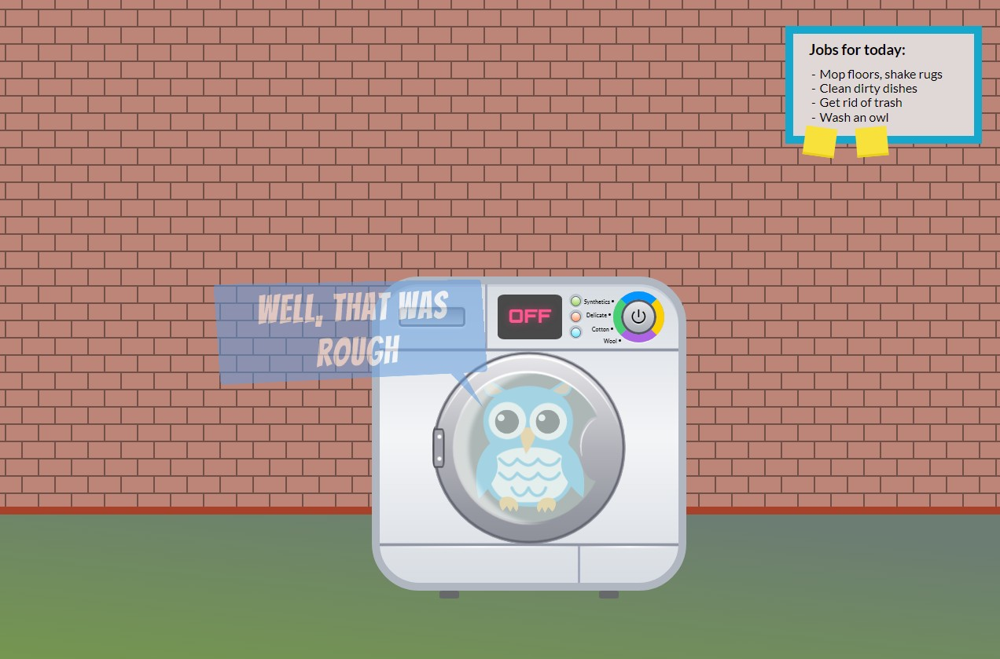
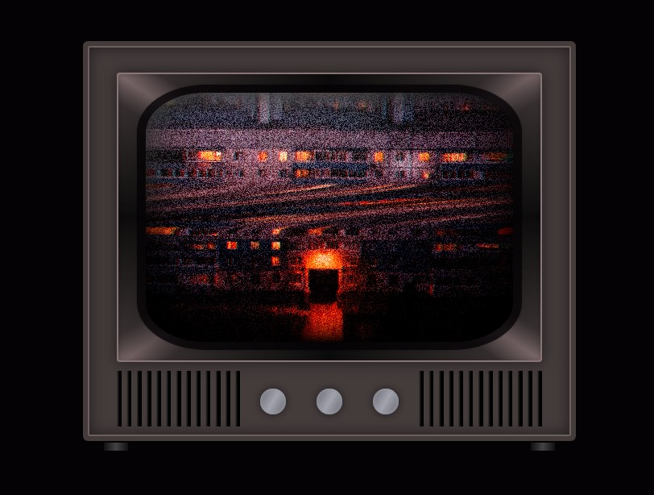
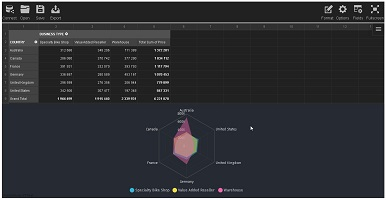
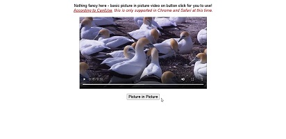

# Demo

## 360°

|Links        |Telas        |
|---          |---          |
| [093.threesixtyjs-master](https://renatomportugal.github.io/04.template/093.threesixtyjs-master/) | |

## 3D

|Links        |Telas        |
|---          |---          |
| [046.Blender](https://renatomportugal.github.io/04.template/046.Blender/) | |
| [047.layered-parallax-effect](https://renatomportugal.github.io/04.template/047.layered-parallax-effect/) | |
|ÓCULOS       |             |
| [048.3d-glasses-comedy-tragedy](https://renatomportugal.github.io/04.template/048.3d-glasses-comedy-tragedy/) | |
| [049.3d-glasses-radical-mathematical](https://renatomportugal.github.io/04.template/049.3d-glasses-radical-mathematical/) | |
| [050.animated-details-element-week-11-52](https://renatomportugal.github.io/04.template/050.animated-details-element-week-11-52/) | |
|ANIMAÇÃO     |             |
| [051.3d-city-animation-pure-css](https://renatomportugal.github.io/04.template/051.3d-city-animation-pure-css/) | |
| [052.3d-web](https://renatomportugal.github.io/04.template/052.3d-web/) | |
| [053.11-z-noise-threejs](https://renatomportugal.github.io/04.template/053.11-z-noise-threejs/) | |
| [054.fake-3d-effect-with-depth-map](https://renatomportugal.github.io/04.template/054.fake-3d-effect-with-depth-map/) | |
| [055.three-js-earth](https://renatomportugal.github.io/04.template/055.three-js-earth/) | |
| [056.WebGLRobot](https://renatomportugal.github.io/04.template/056.WebGLRobot/) | |
| [057.dog-selector](https://renatomportugal.github.io/04.template/057.dog-selector/) | |

## 404

|Links        |Telas        |
|---          |---          |
| [177.space-404](https://renatomportugal.github.io/04.template/177.space-404/) | |
| [178.stranger-things-intro](https://renatomportugal.github.io/04.template/178.stranger-things-intro/) | |

## 8_bits

|Links        |Telas        |
|---          |---          |
| [092.hello-worldcontenteditable-arcade-game-text-effect](https://renatomportugal.github.io/04.template/092.hello-worldcontenteditable-arcade-game-text-effect/) | |

## Abertura

|Links        |Telas        |
|---          |---          |
| [175.holy-robin-quotes](https://renatomportugal.github.io/04.template/175.holy-robin-quotes/) | |

## Admin

|Links        |Telas        |
|---          |---          |
| [182.simple-permission-interface](https://renatomportugal.github.io/04.template/182.simple-permission-interface/) | |

## AdobeXD

|Links        |Telas        |
|---          |---          |
| [183.adobe-xd-repeat-grid](https://renatomportugal.github.io/04.template/183.adobe-xd-repeat-grid/) | |

## Agenda

|Links        |Telas        |
|---          |---          |
| [184.agenda](https://renatomportugal.github.io/04.template/184.agenda/) | |
| [185.calendar-subway-agenda-view](https://renatomportugal.github.io/04.template/185.calendar-subway-agenda-view/) | |
| [186.codepen_omGPqo](https://renatomportugal.github.io/04.template/186.codepen_omGPqo/) | |
| [187.conference-schedule-with-css-grid](https://renatomportugal.github.io/04.template/187.conference-schedule-with-css-grid/) | |
| [188.display-schedule](https://renatomportugal.github.io/04.template/188.display-schedule/) | |
| [189.event-card-grid](https://renatomportugal.github.io/04.template/189.event-card-grid/) | |
| [190.event-card-slider](https://renatomportugal.github.io/04.template/190.event-card-slider/) | |
| [191.event-cards-responsive-arranging-blue-yellow](https://renatomportugal.github.io/04.template/191.event-cards-responsive-arranging-blue-yellow/) | |
| [192.flexbox-card-view-agenda](https://renatomportugal.github.io/04.template/192.flexbox-card-view-agenda/) | |
| [193.semantic-ui](https://renatomportugal.github.io/04.template/193.semantic-ui/) | |
| [194.vertical-timeline-agenda](https://renatomportugal.github.io/04.template/194.vertical-timeline-agenda/) | |
| [263.loop-2step-6](https://renatomportugal.github.io/04.template/263.loop-2step-6/) | |
|Ícones       |Telas        |
| [211.google-calendar-animated-icon](https://renatomportugal.github.io/04.template/211.google-calendar-animated-icon/) | |

## Album

|Links        |Telas        |
|---          |---          |
| [195.challenges-cat-album-with-vue](https://renatomportugal.github.io/04.template/195.challenges-cat-album-with-vue/) | |
| [196.css-grid-image-gallery-with-hover-effect](https://renatomportugal.github.io/04.template/196.css-grid-image-gallery-with-hover-effect/) | |
| [197.hexagon-gallery](https://renatomportugal.github.io/04.template/197.hexagon-gallery/) | |
| [198.infinite-scroll-colcade](https://renatomportugal.github.io/04.template/198.infinite-scroll-colcade/) | |
| [199.our-best-friends](https://renatomportugal.github.io/04.template/199.our-best-friends/) | |

## Alfabeto

|Links        |Telas        |
|---          |---          |
| [094.alphabet](https://renatomportugal.github.io/04.template/094.alphabet/) | |

## Alimentos

|Links        |Telas        |
|---          |---          |
| [200.desserts-click-to-get-more-info](https://renatomportugal.github.io/04.template/200.desserts-click-to-get-more-info/) | |
| [201.egg](https://renatomportugal.github.io/04.template/201.egg/) | |
| [202.krabby-patty](https://renatomportugal.github.io/04.template/202.krabby-patty/) | |
| [203.smoothie-app](https://renatomportugal.github.io/04.template/203.smoothie-app/) | |
| [204.what-s-sharper-than-a-nacho-and-smoother-than-cheese-sauce](https://renatomportugal.github.io/04.template/204.what-s-sharper-than-a-nacho-and-smoother-than-cheese-sauce/) | |

## AnaliseDePalavra

|Links        |Telas        |
|---          |---          |
| [095.word-graphic](https://renatomportugal.github.io/04.template/095.word-graphic/) | |

## Animação

|Cavalo       |Telas        |
| [234.clip-clop-clippity-clop](https://renatomportugal.github.io/04.template/234.clip-clop-clippity-clop/) | |
| [259.muybridge-galloping-horse](https://renatomportugal.github.io/04.template/259.muybridge-galloping-horse/) | |
|Cachorro     |Telas        |
| [232.67puppy-s-night-time](https://renatomportugal.github.io/04.template/232.67puppy-s-night-time/) | |
| [243.boston-terrier-pure-css-image](https://renatomportugal.github.io/04.template/243.boston-terrier-pure-css-image/) | |
| [258.mochi-shiba-vuejs-svg-css-cute](https://renatomportugal.github.io/04.template/258.mochi-shiba-vuejs-svg-css-cute/) | |
|Com CSS      |Telas        |
|---          |---          |
| [205.animal-crossing-isabelle-s-day-off-pure-css](https://renatomportugal.github.io/04.template/205.animal-crossing-isabelle-s-day-off-pure-css/) | |
| [206.nasa-saturn-v-rocket-animated-in-3d-using-only-css](https://renatomportugal.github.io/04.template/206.nasa-saturn-v-rocket-animated-in-3d-using-only-css/) | |
|Celular      |Telas        |
| [212.mobiltelefonens-evolution-svg-shape-morphing](https://renatomportugal.github.io/04.template/212.mobiltelefonens-evolution-svg-shape-morphing/) | |
|Com Fala     |Telas        |
| [213.an-owl-trapped-in-the-instawasher](https://renatomportugal.github.io/04.template/213.an-owl-trapped-in-the-instawasher/) | |
|Costura      |Telas        |
| [214.nick-slater-svg-animated-by-kono](https://renatomportugal.github.io/04.template/214.nick-slater-svg-animated-by-kono/) | |
|Culinária    |Telas        |
| [215.last-glass](https://renatomportugal.github.io/04.template/215.last-glass/) | |
|Disney       |Telas        |
| [216.mickey-and-walt-codepenchallenge](https://renatomportugal.github.io/04.template/216.mickey-and-walt-codepenchallenge/) | |
| [217.pure-css-disney-castle](https://renatomportugal.github.io/04.template/217.pure-css-disney-castle/) | |
|Emoções      |Telas        |
| [218.emotional-character](https://renatomportugal.github.io/04.template/218.emotional-character/) | |
|Gato         |Telas        |
| [237.sleepingCat](https://renatomportugal.github.io/04.template/237.sleepingCat/) | |
| [238.with-your-eyes-closed](https://renatomportugal.github.io/04.template/238.with-your-eyes-closed/) | |
| [241.best-buddies-nappure-css](https://renatomportugal.github.io/04.template/241.best-buddies-nappure-css/) | |
| [242.bongo-cat-codes](https://renatomportugal.github.io/04.template/242.bongo-cat-codes/) | |
| [244.cat-illustration-with-animationpure-css](https://renatomportugal.github.io/04.template/244.cat-illustration-with-animationpure-css/) | |
| [251.cat-in-a-box](https://renatomportugal.github.io/04.template/251.cat-in-a-box/) | |
| [256.grumpy-cat](https://renatomportugal.github.io/04.template/256.grumpy-cat/) | |
| [261.window-cat](https://renatomportugal.github.io/04.template/261.window-cat/) | |
|Girafa       |Telas        |
| [239.codevember-29giraffe](https://renatomportugal.github.io/04.template/239.codevember-29giraffe/) | |
|Google       |Telas        |
| [219.randomly-generated-css-lava-lamp-codepenchallenge](https://renatomportugal.github.io/04.template/219.randomly-generated-css-lava-lamp-codepenchallenge/) | |
|Literatura   |Telas        |
| [220.page-flip](https://renatomportugal.github.io/04.template/220.page-flip/) | |
|Mecânica     |Telas        |
| [221.only-css-gear](https://renatomportugal.github.io/04.template/221.only-css-gear/) | |
|Música       |Telas        |
| [222.LP](https://renatomportugal.github.io/04.template/222.LP/) | |
| [223.nick-slater-sf-airbnb-animated-by-kono](https://renatomportugal.github.io/04.template/223.nick-slater-sf-airbnb-animated-by-kono/) | |
|Pássaros     |Telas        |
| [230.birds](https://renatomportugal.github.io/04.template/230.birds/) | |
|Pessoas      |Telas        |
| [224.eincsstein](https://renatomportugal.github.io/04.template/224.eincsstein/) | |
| [226.vera-voishvilo-animated-svg-by-kono](https://renatomportugal.github.io/04.template/226.vera-voishvilo-animated-svg-by-kono/) | |
|Peixe        |Telas        |
| [252.codevember20curvy-koi-fish](https://renatomportugal.github.io/04.template/252.codevember20curvy-koi-fish/) | |
|Pintinhos    |Telas        |
| [254.eggs](https://renatomportugal.github.io/04.template/254.eggs/) | |
|Poesia       |Telas        |
| [227.poetry](https://renatomportugal.github.io/04.template/227.poetry/) | |
|Programador  |Telas        |
| [225.the-mind-of-a-web-developer-pure-css-svg](https://renatomportugal.github.io/04.template/225.the-mind-of-a-web-developer-pure-css-svg/) | |
|Rinoceronte  |Telas        |
| [255.farting-rhino](https://renatomportugal.github.io/04.template/255.farting-rhino/) | |
| [257.interactive-hippo-button](https://renatomportugal.github.io/04.template/257.interactive-hippo-button/) | |
|StarWars     |Telas        |
| [228.lightsaber](https://renatomportugal.github.io/04.template/228.lightsaber/) | |
|Trem         |Telas        |
| [229.moving-train-animation-pure-css](https://renatomportugal.github.io/04.template/229.moving-train-animation-pure-css/) | |
|Vaca         |Telas        |
| [240.purple-cow-pure-css](https://renatomportugal.github.io/04.template/240.purple-cow-pure-css/) | |

## Ano_Novo
|Animação           |Telas        |
| [249.happy-new-year-2020](https://renatomportugal.github.io/04.template/249.happy-new-year-2020/) | |
|Fogos de Artifício |Telas        |
|---                |---          |
| [247.dots-flocks](https://renatomportugal.github.io/04.template/247.dots-flocks/) | |
| [248.firework](https://renatomportugal.github.io/04.template/248.firework/) | |

## Aparelhos

|Calculadora  |Telas        |
|---          |---          |
| [096.Calculadora](https://renatomportugal.github.io/04.template/096.Calculadora/) | |
|Contador     |Telas        |
| [274.hand-tally-counter](https://renatomportugal.github.io/04.template/274.hand-tally-counter/) | |
|TV           |Telas        |
| [245.old-tv](https://renatomportugal.github.io/04.template/245.old-tv/) | |
| [246.pure-css-home-media-ambilighttry-the-lights](https://renatomportugal.github.io/04.template/246.pure-css-home-media-ambilighttry-the-lights/) | |

## Arduino

|Calculadora  |Telas        |
|---          |---          |
| [172.no-div-arduino-uno-with-lcd-display-and-animation](https://renatomportugal.github.io/04.template/172.no-div-arduino-uno-with-lcd-display-and-animation/) | |

## Astronomia

|Links        |Telas        |
|---          |---          |
| [062.daylight-cycles-of-earth](https://renatomportugal.github.io/04.template/062.daylight-cycles-of-earth) | |

## Audio

|Click        |Telas        |
|---          |---          |
| [098.air-horns](https://renatomportugal.github.io/04.template/098.air-horns) | |
| [120.sound-links-menu](https://renatomportugal.github.io/04.template/120.sound-links-menu) | |

## Background
|Arte         |Telas        |
| [209.responsive-sine-cone-animation](https://renatomportugal.github.io/04.template/209.responsive-sine-cone-animation) | |
| [210.ro](https://renatomportugal.github.io/04.template/210.ro) | |
|Click        |Telas        |
|---          |---          |
| [116.carnaval](https://renatomportugal.github.io/04.template/116.carnaval) | |
|Click        |Telas        |
| [103.Lua](https://renatomportugal.github.io/04.template/103.Lua) | |
|Outros       |Telas        |
| [104.crossing-walls](https://renatomportugal.github.io/04.template/104.crossing-walls) | |
| [105.perticle-rotation-05](https://renatomportugal.github.io/04.template/105.perticle-rotation-05) | |
| [106.tunnel-ride-ii](https://renatomportugal.github.io/04.template/106.tunnel-ride-ii) | |
| [208.zim-domes-tribute-to-scifi-book-artists-codepen-challenge](https://renatomportugal.github.io/04.template/208.zim-domes-tribute-to-scifi-book-artists-codepen-challenge) | |

## Banner

|Click        |Telas        |
|---          |---          |
| [171.single-element-css-banner](https://renatomportugal.github.io/04.template/171.single-element-css-banner) | |

## Biologia

|Click        |Telas        |
|---          |---          |
| [250.global-warming](https://renatomportugal.github.io/04.template/250.global-warming) | |

## Bordados

|Click        |Telas        |
|---          |---          |
| [108.single-div-css-cross-stitch](https://renatomportugal.github.io/04.template/108.single-div-css-cross-stitch) | |

## Bordas

|Click        |Telas        |
|---          |---          |
| [109.dashed-border-generator](https://renatomportugal.github.io/04.template/109.dashed-border-generator) | |

## Busca

|Links        |Telas        |
|---          |---          |
| [059.searching-rod](https://renatomportugal.github.io/04.template/059.searching-rod) | |

## Canvas

|Links        |Telas        |
|---          |---          |
| [004.canvas-events-2011-08-22](https://renatomportugal.github.io/04.template/004.canvas-events-2011-08-22/) ||

## Cards

|Categoria        |Telas        |
|---          |---          |
| [066.product-sorter](https://renatomportugal.github.io/04.template/066.product-sorter/) |  |
|Hover            |Telas        |
| [113.services_tabs](https://renatomportugal.github.io/04.template/113.services_tabs/) |  |
|Outros           |Telas        |
| [114.card_styles](https://renatomportugal.github.io/04.template/114.card_styles/) |  |
| [115.information_cards](https://renatomportugal.github.io/04.template/115.information_cards/) |  |
|Não Resposivos   |Telas        |
| [117.chatroom-project](https://renatomportugal.github.io/04.template/117.chatroom-project/) |  |
| [151.shopping-ui](https://renatomportugal.github.io/04.template/151.shopping-ui/) |  |
| [118.chat-widget](https://renatomportugal.github.io/04.template/118.chat-widget/) |  |
|Resposivos       |Telas        |
| [119.elegant_bootstrap_4_message_chat_box_template](https://renatomportugal.github.io/04.template/119.elegant_bootstrap_4_message_chat_box_template/) |  |
| [266.flexi-bootstrap-thumbnail-cards-cards](https://renatomportugal.github.io/04.template/266.flexi-bootstrap-thumbnail-cards-cards/) |  |
|Prices           |Não Resposivos        |
| [150.pricing-table-design](https://renatomportugal.github.io/04.template/150.pricing-table-design/) |  |
|Blog             |Não Resposivos        |
| [264.article-card](https://renatomportugal.github.io/04.template/264.article-card/) |  |
|3D               |Não Resposivos        |
| [265.css-leaning-card-effect](https://renatomportugal.github.io/04.template/265.css-leaning-card-effect/) |  |

## Cartas

|Categoria        |Telas        |
|---          |---          |
| [267.css-aces](https://renatomportugal.github.io/04.template/267.css-aces/) |  |

## Cartaz

|Categoria        |Telas        |
|---          |---          |
| [268.css-folded-poster-effect](https://renatomportugal.github.io/04.template/268.css-folded-poster-effect/) |  |

## Catalogo

|Música       |Responsivo   |
|---          |---          |
| [163.the-great-ones](https://renatomportugal.github.io/04.template/163.the-great-ones/) |  |

## Click Select

|Links        |Telas        |
|---          |---          |
| [036.responsive-image-map-demo](https://renatomportugal.github.io/04.template/036.responsive-image-map-demo/) ||

## Código_Morse

|Links        |Telas        |
|---          |---          |
| [058.tgmtmorse](https://renatomportugal.github.io/04.template/058.tgmtmorse) | |
| [069.morse-code-alphabet](https://renatomportugal.github.io/04.template/069.morse-code-alphabet) | |

## Código_De_Barras

|Links        |Telas        |
|---          |---          |
| [273.barcode](https://renatomportugal.github.io/04.template/273.barcode/) |  |

## Color

|Picker       |Telas        |
|---          |---          |
| [133.isometric-color-picker](https://renatomportugal.github.io/04.template/133.isometric-color-picker/) |  |

## Console

|Links        |Telas        |
|---          |---          |
| [068.responsive-retro-crt-screen-with-border-image-and-gradient](https://renatomportugal.github.io/04.template/068.responsive-retro-crt-screen-with-border-image-and-gradient) | |
| [154.Console-master-2](https://renatomportugal.github.io/04.template/154.Console-master-2) | |
| [155.cssConsole-master](https://renatomportugal.github.io/04.template/155.cssConsole-master/examples) | |
| [156.javascript-sandbox-console-master](https://renatomportugal.github.io/04.template/156.javascript-sandbox-console-master) | |

## Controles

|Accordion         |Telas        |
| [180.css-responsive-animated-accordion](https://renatomportugal.github.io/04.template/180.css-responsive-animated-accordion) | |
| [181.pure-css-accordion](https://renatomportugal.github.io/04.template/181.pure-css-accordion) | |
|Botões            |Telas        |
| [127.buttonFuturistic](https://renatomportugal.github.io/04.template/127.buttonFuturistic) | |
| [129.jqueryswitch-2014-01-28](https://renatomportugal.github.io/04.template/129.jqueryswitch-2014-01-28) | |
| [130.social-app-menu](https://renatomportugal.github.io/04.template/130.social-app-menu) | |
|Botão de Like     |Telas        |
| [260.paw-clap-button](https://renatomportugal.github.io/04.template/260.paw-clap-button) | |
|Inibidor de Botão |Telas        |
| [235.cat-and-mouse](https://renatomportugal.github.io/04.template/235.cat-and-mouse) | |
|DropDown          |Telas        |
| [128.single-selectiondevextreme-jquery-drop-down-box](https://renatomportugal.github.io/04.template/128.single-selectiondevextreme-jquery-drop-down-box) | |

## Conversões

|Base64       |Telas        |
|---          |---          |
| [107.visualization-of-base64-encoding](https://renatomportugal.github.io/04.template/107.visualization-of-base64-encoding) | |

## Coordenadas

|Links        |Telas        |
|---          |---          |
| [030.mouse-xy-position](https://renatomportugal.github.io/04.template/030.mouse-xy-position/) |  |
| [013.einstein-relativity-codepen-stellar-scientists](https://renatomportugal.github.io/04.template/013.einstein-relativity-codepen-stellar-scientists/) ||
| [042.web-animations-sound-and-custom-cursor-mix](https://renatomportugal.github.io/04.template/042.web-animations-sound-and-custom-cursor-mix/) ||
| [002.animation-project](https://renatomportugal.github.io/04.template/002.animation-project/) ||
| [006.CodePen_Export_mapsv](https://renatomportugal.github.io/04.template/006.CodePen_Export_mapsv/) ||
| [009.crop-image-with-focus-point-cropper](https://renatomportugal.github.io/04.template/009.crop-image-with-focus-point-cropper/) ||
| [017.image-cropper-2012-07-04](https://renatomportugal.github.io/04.template/017.image-cropper-2012-07-04/) ||
| [027.linear-interp](https://renatomportugal.github.io/04.template/027.linear-interp/) ||
| [029.mouse-coord](https://renatomportugal.github.io/04.template/029.mouse-coord/) ||

## Covid

|Avatar       |Telas        |
|---          |---          |
| [276.pure-css-avatar](https://renatomportugal.github.io/04.template/276.pure-css-avatar/) |  |
|Campanha     |Telas        |
| [275.2020](https://renatomportugal.github.io/04.template/275.2020/) |  |

## CSS

|Links        |Telas        |
|---          |---          |
| [065.only-css-showcase-car](https://renatomportugal.github.io/04.template/065.only-css-showcase-car/) |  |

## Cursor

|Links        |Telas        |
|---          |---          |
| [278.cursors](https://renatomportugal.github.io/04.template/278.cursors/) |  |
| [279.custom-cursors-using-data-uri](https://renatomportugal.github.io/04.template/279.custom-cursors-using-data-uri/) |  |

## CV

|Responsivo   |Telas        |
|---          |---          |
| [157.a-minimalist-resume](https://renatomportugal.github.io/04.template/157.a-minimalist-resume/) |  |
| [158.resume](https://renatomportugal.github.io/04.template/158.resume/) |  |

## Dashboard

|Responsivo   |Telas                   |
|---          |---                     |
| [159.animating-charts-grid](https://renatomportugal.github.io/04.template/159.animating-charts-grid/) |  |
| [160.windows-8-metro-ui](https://renatomportugal.github.io/04.template/160.windows-8-metro-ui/) |  |
|Local não    |Funciona só em Servidor |
| [161.codepen_ajCxc](https://renatomportugal.github.io/04.template/161.codepen_ajCxc/) |  |

## Data-Table

|Links          |Telas        |
|---            |---          |
|Não Responsivo |---          |
| [135.panel_tables_with_filter](https://renatomportugal.github.io/04.template/135.panel_tables_with_filter/) |  |
| [138.dashboard-with-webdatarocks-and-fusioncharts-dark-theme](https://renatomportugal.github.io/04.template/138.dashboard-with-webdatarocks-and-fusioncharts-dark-theme/) |  |
| [141.material-sortable-datatable](https://renatomportugal.github.io/04.template/141.material-sortable-datatable/) |  |
| [143.responsive-table-with-datatables](https://renatomportugal.github.io/04.template/143.responsive-table-with-datatables/) |  |
|Responsivo     |---          |
| [136.billionaires-responsive-table034-of-100days100projects](https://renatomportugal.github.io/04.template/136.billionaires-responsive-table034-of-100days100projects/) |  |
| [137.codepen_aLVXGO](https://renatomportugal.github.io/04.template/137.codepen_aLVXGO/) |  |
| [140.mantenimiento-simple-con-angular-material-y-lodash](https://renatomportugal.github.io/04.template/140.mantenimiento-simple-con-angular-material-y-lodash/) |  |
| [142.responsive-product-comparison-table](https://renatomportugal.github.io/04.template/142.responsive-product-comparison-table/) |  |
| [144.table2](https://renatomportugal.github.io/04.template/144.table2/) |  |

## Diagrama_De_Força

|Links        |Telas        |
|---          |---          |
| [015.force-directed-diagram](https://renatomportugal.github.io/04.template/015.force-directed-diagram/) ||
| [024.it-system-interface-explorer](https://renatomportugal.github.io/04.template/024.it-system-interface-explorer/) ||

## E-Commerce

|Links        |Telas        |
|---          |---          |
| [060.CodePen_Export_Nqwbmg](https://renatomportugal.github.io/04.template/060.CodePen_Export_Nqwbmg) | |
|Produtos | Não Responsivo |
| [145.css-big-box-pc-games](https://renatomportugal.github.io/04.template/145.css-big-box-pc-games) | |
| [146.css-trapper-keeper-effect](https://renatomportugal.github.io/04.template/146.css-trapper-keeper-effect) | |
| [147.pricingpure-css16](https://renatomportugal.github.io/04.template/147.pricingpure-css16) | |
| [173.ui-to-code-1-juuce-app](https://renatomportugal.github.io/04.template/173.ui-to-code-1-juuce-app) | |
|Tamanho      |Não Responsivo  |
| [152.xs-s-m-l-xl](https://renatomportugal.github.io/04.template/152.xs-s-m-l-xl) | |
|Tickets      |Responsivo      |
| [148.choose-ticketpure-css08](https://renatomportugal.github.io/04.template/148.choose-ticketpure-css08) | |
|Tickets      |Não Responsivo  |
| [149.folding-ticket-detail](https://renatomportugal.github.io/04.template/149.folding-ticket-detail) | |
|Serviços     |Responsivo |
| [179.css-grid-workout-schedule](https://renatomportugal.github.io/04.template/179.css-grid-workout-schedule) | |

## Editor

|Links        |Telas        |
|---          |---          |
| [028.map-creator](https://renatomportugal.github.io/04.template/028.map-creator/) ||

## Equipes

|Responsivo   |Telas        |
|---          |---          |
| [164.material-design-responsive-card](https://renatomportugal.github.io/04.template/164.material-design-responsive-card) | |
| [165.snap-it-like-thanos](https://renatomportugal.github.io/04.template/165.snap-it-like-thanos) | |

## Fluxograma

|Responsivo   |Telas        |
|---          |---          |
| [166.flowchart-gojs](https://renatomportugal.github.io/04.template/166.flowchart-gojs) | |

## Fonts

|Links        |Telas        |
|---          |---          |
| [064.old-paper](https://renatomportugal.github.io/04.template/064.old-paper) | |

## Formulários

|Links        |Telas        |
|---          |---          |
| [131.bootstrap-3-contact-form-with-validation](https://renatomportugal.github.io/04.template/131.bootstrap-3-contact-form-with-validation/) |  |
| [132.elegant-contact-form](https://renatomportugal.github.io/04.template/132.elegant-contact-form/) |  |
|Abelhas      |Telas        |
| [231.not-the-bees](https://renatomportugal.github.io/04.template/231.not-the-bees/) |  |

## Gradient_Generator

|Links        |Telas        |
|---          |---          |
| [174.5-way-gradient-generator](https://renatomportugal.github.io/04.template/174.5-way-gradient-generator/) |  |
| [270.proof-of-concept-chart-js-with-background-gradient](https://renatomportugal.github.io/04.template/270.proof-of-concept-chart-js-with-background-gradient/) |  |

## Gráficos

|Links        |Telas        |
|---          |---          |
| [269.amcharts-4-sankey-diagram](https://renatomportugal.github.io/04.template/269.amcharts-4-sankey-diagram/) |  |

## Hot_Relod

|Botões       |Telas        |
|---          |---          |
| [277.social-distancing-in-cs](https://renatomportugal.github.io/04.template/277.social-distancing-in-cs/) |  |

## Hover

|Botões       |Telas        |
|---          |---          |
| [110.fireflies](https://renatomportugal.github.io/04.template/110.fireflies/) |  |

## IHM - Interface Homem Máquina

|Botões       |Telas        |
|---          |---          |
| [020.self-destruct-button](https://renatomportugal.github.io/04.template/020.self-destruct-button/) |  |
| [063.draggable-skeuomorph-switchtoggle](https://renatomportugal.github.io/04.template/063.draggable-skeuomorph-switchtoggle) | |
| [100.realistic-red-switch-pure-css](https://renatomportugal.github.io/04.template/100.realistic-red-switch-pure-css) | |
|Gauges       |Telas        |
| [121.barraHorizontal](https://renatomportugal.github.io/04.template/121.barraHorizontal/) |  |
| [122.circular1](https://renatomportugal.github.io/04.template/122.circular1/) |  |
| [123.circular2](https://renatomportugal.github.io/04.template/123.circular2/) |  |
| [124.circular3](https://renatomportugal.github.io/04.template/124.circular3/) |  |
| [125.Gauge](https://renatomportugal.github.io/04.template/125.Gauge/) |  |
| [126.ponteiro](https://renatomportugal.github.io/04.template/126.ponteiro/) |  |
|Painéis      |Telas        |
| [102.apollo-agc-apollo-guidance-computer](https://renatomportugal.github.io/04.template/102.apollo-agc-apollo-guidance-computer/) |  |
|Mostrador Mecânico |Telas        |
| [101.mechincal-number-counter](https://renatomportugal.github.io/04.template/101.mechincal-number-counter/) |  |

## Imagem_Camadas

|Links        |Telas        |
|---          |---          |
| [032.photo-id](https://renatomportugal.github.io/04.template/032.photo-id/) ||
| [016.handling-user-uploaded-images-by-derya](https://renatomportugal.github.io/04.template/016.handling-user-uploaded-images-by-derya/) ||
| [043.xlayers-2013-08-02](https://renatomportugal.github.io/04.template/043.xlayers-2013-08-02/) ||
| [044.z-index-and-stacking-context](https://renatomportugal.github.io/04.template/044.z-index-and-stacking-context/) ||
| [045.z-index-sass-management](https://renatomportugal.github.io/04.template/045.z-index-sass-management/) ||

## Imagem_Cortar_Subir_Salvar

|Links        |Telas        |
|---          |---          |
| [034.practice-003crop-image](https://renatomportugal.github.io/04.template/034.practice-003crop-image/) ||

## Imagem_Corte

|Links        |Telas        |
|---          |---          |
| [018.image-cropper-prototype](https://renatomportugal.github.io/04.template/018.image-cropper-prototype/) ||
| [040.vue_image-crop](https://renatomportugal.github.io/04.template/040.vue_image-crop/) ||
| [007.crop-image](https://renatomportugal.github.io/04.template/007.crop-image/) ||

## Imagem_Corte_Base64

|Links        |Telas        |
|---          |---          |
| [003.browser-image-crop](https://renatomportugal.github.io/04.template/003.browser-image-crop/) ||
| [010.cropper-try](https://renatomportugal.github.io/04.template/010.cropper-try/) ||
| [011.croppie-modal-error](https://renatomportugal.github.io/04.template/011.croppie-modal-error/) ||

## Imagem_Corte_Com_Mascara

|Links        |Telas        |
|---          |---          |
| [008.crop-image-using-svg](https://renatomportugal.github.io/04.template/008.crop-image-using-svg/) ||

## Imagem_Mapeamento

|Links        |Telas        |
|---          |---          |
| [021.impact-summary-map-template-js-master](https://renatomportugal.github.io/04.template/021.impact-summary-map-template-js-master/) ||

## Infográfico

|Links        |Telas        |
|---          |---          |
| [023.infografico-json](https://renatomportugal.github.io/04.template/023.infografico-json/) | |
| [035.pure-css-circles-infographic-JSON](https://renatomportugal.github.io/04.template/035.pure-css-circles-infographic-JSON/) | |
| [037.responsive-infographic-css-variables-grid.JSON](https://renatomportugal.github.io/04.template/037.responsive-infographic-css-variables-grid.JSON/) | |
|Surf         |Telas        |
| [271.surf-world-league](https://renatomportugal.github.io/04.template/271.surf-world-league) | |

## KeyGen

|Links        |Telas        |
|---          |---          |
| [097.KeyGen](https://renatomportugal.github.io/04.template/097.KeyGen) | |

## Layout

|Links        |Telas        |
|---          |---          |
| [067.pyramid-layout](https://renatomportugal.github.io/04.template/067.pyramid-layout) | |

## Landing_Page

|Links        |Telas        |
|---          |---          |
| [061.codepenchallenge-typeset-this-post](https://renatomportugal.github.io/04.template/061.codepenchallenge-typeset-this-post) | |

## Lista de Pessoas

|Links        |Telas        |
|---          |---          |
| [039.user-list-with-quick-search](https://renatomportugal.github.io/04.template/039.user-list-with-quick-search/) ||
| [001.alan-sugar-s-fired-employeesvue-transitions-challenge](https://renatomportugal.github.io/04.template/001.alan-sugar-s-fired-employeesvue-transitions-challenge/) ||
| [033.police-academy-characters](https://renatomportugal.github.io/04.template/033.police-academy-characters/) ||
| [038.tabs-navigation-ui](https://renatomportugal.github.io/04.template/038.tabs-navigation-ui/) ||
| [041.vuetify-avatars-group](https://renatomportugal.github.io/04.template/041.vuetify-avatars-group/) ||

## Mensagem

|Chat         |Telas        |
|---          |---          |
| [272.apple-imessage-in-css](https://renatomportugal.github.io/04.template/272.apple-imessage-in-css) | |

## Mouse

|Cavalo       |Telas        |
|---          |---          |
| [233.bojack-s-face-animated-w-gsap](https://renatomportugal.github.io/04.template/233.bojack-s-face-animated-w-gsap) | |

## Neon

|404          |Telas        |
|---          |---          |
| [176.neon404-page-not-found](https://renatomportugal.github.io/04.template/176.neon404-page-not-found/) | |
|Arco-íris    |Telas        |
| [262.configurable-glowing-rainbow-react-component](https://renatomportugal.github.io/04.template/262.configurable-glowing-rainbow-react-component/) | |

## Organograma

|Links        |Telas        |
|---          |---          |
| [012.Cursos](https://renatomportugal.github.io/04.template/012.Cursos/) ||

## Pascoa
|Links        |Telas        |
|---          |---          |
| [253.easter-rabbit](https://renatomportugal.github.io/04.template/253.easter-rabbit) | |

## Paint_Brush
|Links        |Telas        |
|---          |---          |
| [112.native-js-day-8-drawing-canvas](https://renatomportugal.github.io/04.template/112.native-js-day-8-drawing-canvas) | |

## Preview de Upload

|Links        |Telas        |
|---          |---          |
| [014.file-upload-preview-image](https://renatomportugal.github.io/04.template/014.file-upload-preview-image/) ||
| [019.image-upload-preview](https://renatomportugal.github.io/04.template/019.image-upload-preview/) ||
| [025.jquery-image-upload-preview](https://renatomportugal.github.io/04.template/025.jquery-image-upload-preview/) ||
| [026.knockout-js-html5-file-bindings-with-upload-preview-and-drag-and-drop](https://renatomportugal.github.io/04.template/026.knockout-js-html5-file-bindings-with-upload-preview-and-drag-and-drop/) ||

## Responsivo

|Links        |Telas        |
|---          |---          |
| [005.chrome-bug-blurry-stops-when-more-than-8-colors](https://renatomportugal.github.io/04.template/005.chrome-bug-blurry-stops-when-more-than-8-colors/) ||
| [031.padding-versus-margin-in-the-real-world](https://renatomportugal.github.io/04.template/031.padding-versus-margin-in-the-real-world/) ||

## Ribbon

|Links        |Telas        |
|---          |---          |
| [153.css-ribbon](https://renatomportugal.github.io/04.template/153.css-ribbon) | |
| [167.corner-ribbons](https://renatomportugal.github.io/04.template/167.corner-ribbons) | |
| [168.css-clip-path-ribbons](https://renatomportugal.github.io/04.template/168.css-clip-path-ribbons) | |
| [169.demo-pure-css-corner-ribbon](https://renatomportugal.github.io/04.template/169.demo-pure-css-corner-ribbon) | |
| [170.pure-css-corner-ribbon](https://renatomportugal.github.io/04.template/170.pure-css-corner-ribbon) | |

## Scroll Infinito

|Links        |Telas        |
|---          |---          |
| [022.infinity-scroll-with-angularjs](https://renatomportugal.github.io/04.template/022.infinity-scroll-with-angularjs/) ||

## Testes

|Links        |Telas        |
|---          |---          |
| [162.technical-page](https://renatomportugal.github.io/04.template/162.technical-page) | |

## Texto

|Autocomplete |Telas        |
|---          |---          |
| [099.autocomplete](https://renatomportugal.github.io/04.template/099.autocomplete) | |

## Videos

|YouTube      |Telas        |
|---          |---          |
| [070.ng-youtube-embed-demo](https://renatomportugal.github.io/04.template/070.ng-youtube-embed-demo) | |
| [071.youtube-embeds-optimized-jquery-edition](https://renatomportugal.github.io/04.template/071.youtube-embeds-optimized-jquery-edition) | |
| [072.youtube-picture-in-picture-demo-for-desktop](https://renatomportugal.github.io/04.template/072.youtube-picture-in-picture-demo-for-desktop) | |
| [073.youtube-video](https://renatomportugal.github.io/04.template/073.youtube-video) | |
|Background   |Telas        |
| [074.background-video](https://renatomportugal.github.io/04.template/074.background-video) | |
| [075.background-video-random-playlist](https://renatomportugal.github.io/04.template/075.background-video-random-playlist) | |
| [076.blurred-video-effect-w-css-filter](https://renatomportugal.github.io/04.template/076.blurred-video-effect-w-css-filter) | |
| [077.fullscreen-background-video-with-mix-blend-mode-overlay-text](https://renatomportugal.github.io/04.template/077.fullscreen-background-video-with-mix-blend-mode-overlay-text) | |
| [078.fullscreen-html5-page-background-video](https://renatomportugal.github.io/04.template/078.fullscreen-html5-page-background-video) | |
| [079.maintenance-status-page-with-video-background](https://renatomportugal.github.io/04.template/079.maintenance-status-page-with-video-background) | |
| [080.video-button-animation](https://renatomportugal.github.io/04.template/080.video-button-animation) | |
| [134.rick-roll-knockout-text](https://renatomportugal.github.io/04.template/134.rick-roll-knockout-text) | |
|Catálogo     |Telas        |
| [081.movieCard](https://renatomportugal.github.io/04.template/081.movieCard) | |
|Filtros      |Telas        |
| [082.gradient-map-filters-on-video](https://renatomportugal.github.io/04.template/082.gradient-map-filters-on-video) | |
|Local        |Telas        |
| [083.video_local](https://renatomportugal.github.io/04.template/083.video_local) | |
| [084.videoHtml5](https://renatomportugal.github.io/04.template/084.videoHtml5) | |
|Scroll       |Telas        |
| [085.popout-video](https://renatomportugal.github.io/04.template/085.popout-video) | |
|Timeline     |Telas        |
| [086.mcu-timeline-carousel](https://renatomportugal.github.io/04.template/086.mcu-timeline-carousel) | |
|Outros       |Telas        |
| [087.basic-picture-in-picture-video](https://renatomportugal.github.io/04.template/087.basic-picture-in-picture-video) | |
| [088.easy-html5-video-custom-controls](https://renatomportugal.github.io/04.template/088.easy-html5-video-custom-controls) | |
| [089.html5-video-webvtt-example-master](https://renatomportugal.github.io/04.template/089.html5-video-webvtt-example-master) | |
| [090.picture-in-picture-video-player-new-on-chrome-70](https://renatomportugal.github.io/04.template/090.picture-in-picture-video-player-new-on-chrome-70) | |
| [091.picture-in-picture-web-api](https://renatomportugal.github.io/04.template/091.picture-in-picture-web-api) | |
|Vímeo        |Telas        |
| [207.Vimeo-jQuery-API-master](https://renatomportugal.github.io/04.template/207.Vimeo-jQuery-API-master) | |

## Novo

|Links        |Telas        |
|---          |---          |
| [046.Blender](https://renatomportugal.github.io/04.template/) | |